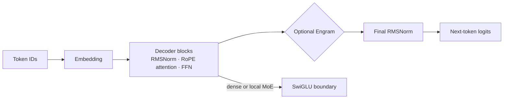

# Tiny Sparse Lab

**A small-model workbench for learning, training usable narrow capabilities, and testing architectural ideas.**

Tiny Sparse Lab is for builders who want to move beyond diagrams: change one architectural boundary, train a controlled local run, chat with the resulting checkpoint, and measure what actually improved. Keep the task and evidence as models grow rather than discard each experiment. It is a single-host reference workbench, not a production training service or a claim that a tiny model can do everything.

The supported runtime is one process on one host using one correctly detected CPU or accelerator. PyTorch is the canonical engine; the optional MLX engine provides a dense local Metal path on Apple Silicon. Distributed process groups, remote workers, and multi-host scheduling are intentionally deferred.

**New to training models? Start with [From flashcards to a useful local assistant](docs/from-toy-to-useful.md).** It explains why `amber → lumen` is an invented recall exercise, provides a small instruction-training recipe and a normal chat prompt, and follows a concrete path toward useful domain tasks. Parameter count is capacity, not a certificate of intelligence.

## Why try it?

- **Learn mechanisms in context.** Follow RMSNorm, RoPE, causal attention, SwiGLU, local MoE routing, latent attention, and addressed memory through runnable code rather than isolated snippets.
- **Train something testable.** The chat-native recall curriculum supplies learned-association and context-override cards; bring licensed JSONL conversations and declarative cards for your own tasks.
- **Keep evidence with the run.** Configurations, prepared data, tokenizer artifacts, checkpoints, evaluation reports, metrics, and lineage remain local and inspectable.
- **Make honest claims.** Measure trained versus untrained behavior and matched architecture pairs. Synthetic task success is narrow evidence; zero deltas and failures remain results, not marketing.
- **Extend carefully.** New Engram variants, attention paths, and scale experiments can reuse the existing causal data, checkpoint, metric, and comparison boundaries instead of introducing hidden semantics.

## What is implemented

| Area | Explore | Boundary |
|---|---|---|
| Decoder and chat | RMSNorm, RoPE causal attention, SwiGLU; interactive/single-turn chat, seeded sampling, saved transcripts | Verified PyTorch checkpoint and run-owned tokenizer; no hosted service or general conversation guarantee. |
| Attention | Dense, sliding-window, block-sparse selection, and multi-head latent attention (MLA) | Reference implementations; no native sparse kernels or KV-cache performance claim. |
| Feed-forward sparsity | Local Top-K MoE with an optional shared expert and routing diagnostics | No expert sharding, capacity clipping, token dropping, or all-to-all exchange. |
| Engram memory | Causal token n-gram, raw UTF-8 byte-addressed, and portable frozen-table adapters | Addressing diagnostics are not retrieval-quality or transfer proof. |
| Training evidence | Deterministic local training, validated checkpoints, held-out reports, versioned cards and controlled comparisons | Artifact integrity and task scores are distinct from broad quality. |
| Accelerators | Local CPU, MPS, CUDA/ROCm, and XPU discovery for PyTorch; optional MLX Metal training | Hardware-specific acceptance remains pending where target hardware is unavailable. |

## Start here

Requirements: Python 3.12 and [uv](https://docs.astral.sh/uv/).

Run these configuration-based commands from the repository root. Run consumers such as `chat` and `eval` also work from subdirectories: their default run store is `runs/` at the nearest `pyproject.toml`. Use an explicit `--runs-dir /path/to/runs` for another store; see [path resolution](docs/using-sparselab.md#chat-with-a-saved-run).

```sh
uv sync --locked --dev
uv run sparselab tokenizer train configs/tokenizer_smoke.yaml
uv run sparselab data prepare configs/smoke_cpu.yaml
uv run sparselab inspect configs/smoke_cpu.yaml --json
uv run sparselab train configs/smoke_cpu.yaml --run-id dense-smoke
uv run sparselab eval dense-smoke
uv run sparselab generate dense-smoke --prompt "Once upon a time" --max-new-tokens 24
uv run sparselab chat dense-smoke --max-new-tokens 12
uv run sparselab dashboard --runs-dir runs
```

The smoke run is intentionally small. It proves the local tokenizer → prepared data → training → checkpoint → evaluation → generation path; it does not promise fluent generation or comparative model quality.

### Chat with a trained local run

```sh
uv run sparselab tokenizer train configs/tokenizer_chat_recall.yaml
uv run sparselab train configs/chat_recall_dense_cpu.yaml --run-id chat-dense
uv run sparselab train configs/chat_recall_engram_cpu.yaml --run-id chat-engram
uv run sparselab chat chat-engram --system "Answer the requested alias with only its value." --max-new-tokens 12 --transcript /tmp/chat-engram.json
uv run sparselab capability compare chat-dense chat-engram chat-alias-retention-v1
uv run sparselab capability compare chat-dense chat-engram chat-alias-recall-v1
uv run sparselab capability compare chat-dense chat-engram chat-context-override-v1
```

Here “alias” means the front of a flashcard and “value” means its arbitrary answer. `amber → lumen` has no intended real-world meaning. For a more familiar conversation experiment, use the [3.3M instruction starter](docs/from-toy-to-useful.md#5-a-smaller-instruction-learner-before-the-100m-run), not a new system prompt on the alias model.

Chat is a first-class test surface, not a promise of commercial-model behavior. Training, interactive chat, and the new capability cards share the same transcript format and decoder. Chat preserves the current user/system turn, drops only complete old turns when needed, and can save the exact prompt, settings, checkpoint identity, and reply. Use `--checkpoint best.json`, `--message`, `--json`, or seeded sampling as needed.

The [capability workflow](docs/capabilities.md) explains learned versus in-context recall, exact-answer scoring, matched controls, negative results, and scaling. The [instruction guide](docs/instruction-training.md) supports your own licensed local conversation corpus. A trained model must earn a task claim through held-out evidence; architectural complexity alone does not make it useful.

The [repository review and measured example](docs/project-review.md) records what this path demonstrates, what it failed to demonstrate, and the next evidence gaps.

### Resume a local run

Use `--stop-after-step` to create a durable interruption boundary, then resume into a new child run from the latest validated generation:

```sh
uv run sparselab train configs/smoke_moe_cpu.yaml --run-id moe-part --stop-after-step 20
uv run sparselab checkpoint verify runs/moe-part/checkpoints/latest.json --json
uv run sparselab train configs/smoke_moe_cpu.yaml --run-id moe-resumed \
  --resume runs/moe-part/checkpoints/latest.json
```

Resume requires compatible local model, optimizer, data, tokenizer, and training contracts. Promotion can reuse the same architecture/tokenizer weights with a new backend, corpus, or training schedule. Neither operation grows a small backbone into a larger one.

### Apple Silicon: optional MLX engine

```sh
uv sync --locked --dev --extra mlx
uv run sparselab train configs/smoke_mlx.yaml --run-id mlx-smoke
uv run sparselab checkpoint verify runs/mlx-smoke/mlx_checkpoints/step_00000040 --json
```

MLX checkpoints retain local native Metal state. `checkpoint inspect` checks their metadata and required state files; MLX resume takes the checkpoint directory. This experimental training path does not yet have the PyTorch chat/capability evidence contract. It must not be presented as feature-parity or tamper-proof checkpoint verification.

## Suggested learning path

1. **Establish the baseline.** Run `smoke_cpu`, inspect its parameter inventory, and read [the decoder architecture](docs/architecture.md).
2. **Change one boundary.** Compare dense, [sliding/block-sparse attention](docs/sparse-attention.md), [MLA](docs/mla.md), or [local MoE](docs/moe.md) under matched settings.
3. **Study memory as an architectural mechanism.** Run token and [byte-addressed Engram](docs/engram.md), then read the [portable Engram](docs/portable-engram.md) contract before making transfer claims.
4. **Treat diagnostics as evidence.** Use the [metrics guide](docs/metrics.md), [training and resume guide](docs/training.md), and [withheld-fact diagnostic](docs/withheld-facts.md) to distinguish a measured observation from a conclusion.
5. **Scale deliberately.** Inspect explicit presets first; use the [experiment protocol](docs/experiments.md) to preserve comparison conditions.

## Architecture at a glance



The architectural options are explicit configuration choices, not automatic optimization. `smoke_combined_cpu.yaml` composes MLA, local MoE, and byte memory as a compatibility check; it is not evidence that the combination improves quality or throughput.

## Documentation map

- [From flashcards to a useful local assistant](docs/from-toy-to-useful.md) — beginner concepts, normal chat prompts, a runnable instruction starter, domain adaptation, evaluation, and scale limits.

- [Using SparseLab](docs/using-sparselab.md) — commands, local artifacts, and dashboard.
- [Architecture](docs/architecture.md) — decoder and mechanism boundaries.
- [Training and resume](docs/training.md) — local run lifecycle and checkpoint semantics.
- [Runtime policy](docs/runtime.md) — backend selection and resource terminology.
- [Engram](docs/engram.md), [byte addressing](docs/byte-addressing.md), and [portable Engram](docs/portable-engram.md) — memory contracts and diagnostics.
- [MoE](docs/moe.md), [sparse attention](docs/sparse-attention.md), and [MLA](docs/mla.md) — reference mechanism behavior.
- [Experiments](docs/experiments.md), [model scaling](docs/model-scaling.md), and [metrics](docs/metrics.md) — controlled comparison practice.
- [Experiment evidence](docs/evidence.md) — verified checkpoints, held-out observations, controlled comparisons, and hardware-reference discipline.
- [Capability experiments](docs/capabilities.md) — versioned narrow hypotheses, matched baselines, and scale-series evidence.
- [Instruction and local conversation training](docs/instruction-training.md) — licensed JSONL corpus input, shared chat format, and the synthetic 100M reference.
- [Withheld facts](docs/withheld-facts.md) — deterministic data-separation evidence.
- [Architecture decisions](docs/decisions/README.md) — durable design context and current scope decisions.
- [Deferred roadmap](TODO.md) — native kernels, target-hardware acceptance, and distributed work intentionally outside the core.

## Data, licensing, and contribution

Synthetic data is an offline fixture. TinyStories artifacts retain pinned source/revision and license metadata locally; do not commit downloaded corpora, prepared arrays, run directories, or checkpoints. Project source is MIT licensed; downloaded datasets retain their own terms.

Contributions should preserve explicit causal, configuration, artifact, and comparison contracts. Read [CONTRIBUTING.md](CONTRIBUTING.md), verify the affected local behavior, and add a focused regression only when it protects an observable contract.
