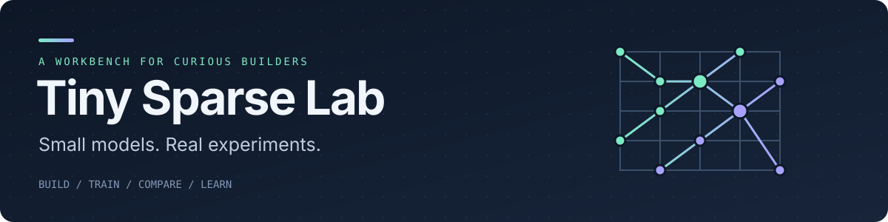
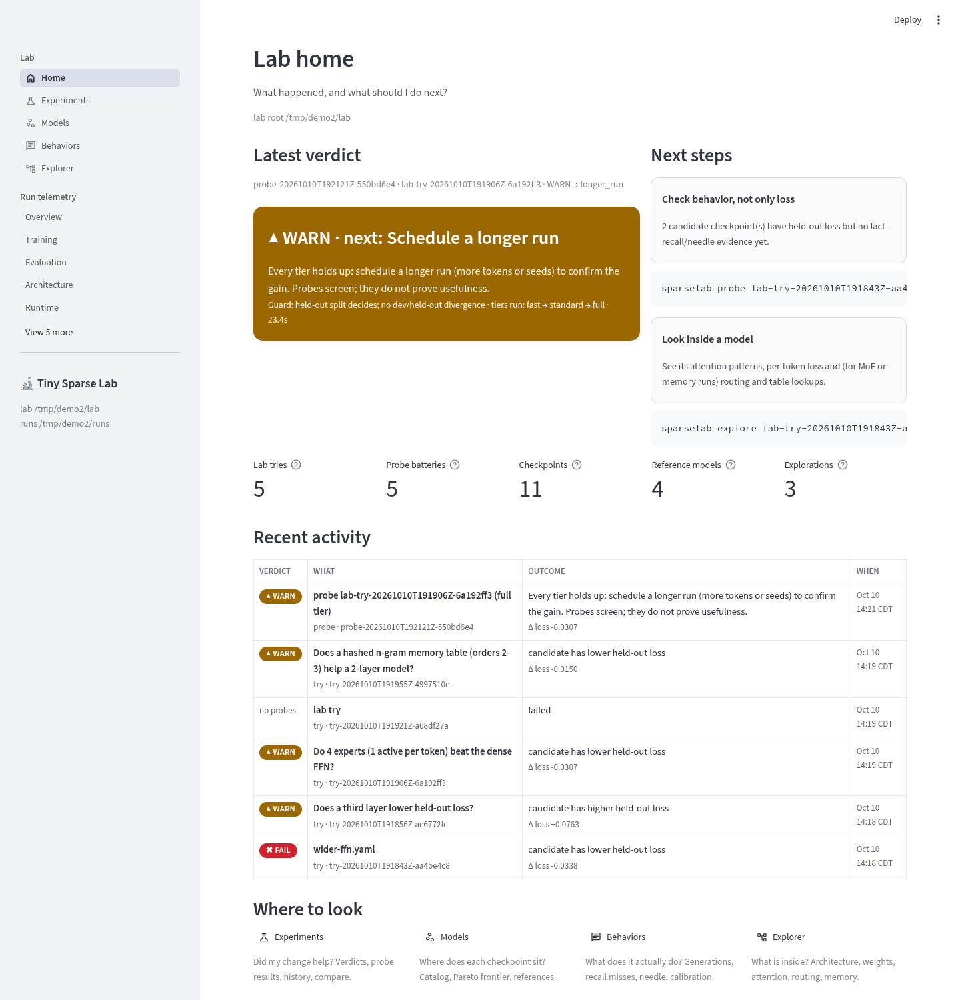

<p align="center">
  
</p>

<p align="center">
  <a href="https://github.com/supernovae/tiny-sparse-lab/actions/workflows/ci.yml"></a>
  <a href="pyproject.toml"></a>
  <a href="LICENSE"></a>
  <a href="docs/experiment-programs.md"></a>
</p>

<p align="center">
  <a href="docs/tinystories-microlab.md">Build your first microlab</a> ·
  <a href="docs/experiment-programs.md">Write a training program</a> ·
  <a href="docs/using-sparselab.md">CLI guide</a> ·
  <a href="docs/research/roadmap.md">Research roadmap</a>
</p>

Tiny Sparse Lab is a workbench for building small language models and finding
out what makes them learn. Start with a story-writing decoder, add sparse
attention, routed experts, or Engram memory, and compare what changed in quality,
speed, and memory. We're building a lab where a training program is readable
YAML, each checkpoint carries its inputs and history, and the evidence stays
with the experiment—from your first laptop run to a controlled research campaign.

## Feature matrix

Support describes the shipped lab interfaces; scientific outcomes live in the
[experiment ledger](docs/research/experiment-ledger.md). Backend restrictions are
listed below and in the [runtime guide](docs/runtime.md).

| Feature | Available workflow | Boundary / guide |
| --- | --- | --- |
| Tokenizer, preparation, training and generation | Native CLI and YAML RunConfig | [First story model](docs/tinystories-microlab.md); data and weights need local storage. |
| Attention comparisons | Dense, sliding-window, block-sparse and reference MLA | [Architecture](docs/architecture.md); reference mechanisms are not full paper reproductions. |
| Conditional capacity | Local Top-K MoE; token, byte and portable Engram | [Capability experiments](docs/capabilities.md); resident and active parameters differ. |
| Training programs | Matrices, immutable ExperimentPlan locks and checkpoint phases | [DSL](docs/experiment-programs.md); child dispatch follows verified parent completion. |
| Campaign orchestration | Declared dependencies, readiness, approvals and reconciliation | [Campaigns](docs/campaigns.md); independent single-device runs. |
| Corpus provenance | Acquire, shape, freeze, export and verify source identities | [Corpus Forge sample](corpora/devmind-sample-v0/README.md); source terms remain separate. |
| Declarative text datasets | Pin Hub sources, snapshot, resume, report coverage and propose pass budgets | [Dataset interfaces](docs/datasets.md); explicit resource limits and immutable inputs. |
| Instruction objectives | Whole-transcript or assistant-only loss on local conversations | [Instruction training](docs/instruction-training.md); tool transcripts are inert. |
| Evaluation and review | Held-out loss, capability cards, checkpoint-bound suites, self-blind review | [Evidence](docs/evidence.md); promotion requires review. |
| Native diagnostics | Supplied-vector semantic probes, continuation overlap, bounded preparation benchmarks and opt-in phase observations | [CLI guide](docs/using-sparselab.md#native-diagnostic-interfaces); mechanism/descriptive/operational evidence, not quality or promotion gates. |
| Local, SSH, and supplied hosted execution | Explicit runtime selection, staging, independent worker queues, and optional relay-backed Colab | [Hosted environments](docs/hosted-environments.md); one device per run, no provider allocation or distributed training. |
| Dashboard | Lab home with next steps, experiments and verdicts, model catalog and Pareto frontier, behaviors (generations, recall misses, calibration), a visual model explorer, plus training telemetry and research views | [Dashboard tour](docs/dashboard.md); [research views](docs/research/dashboard.md); read-only. |
| Local model exploration | Raw completion, transcript chat, Streamlit comparisons and a loopback API | [Model guide](docs/tinytext-model-guide.md); [nonstreaming API](docs/local-api.md); verified local run required. |

Watch loss curves, throughput, memory, and checkpoint history in the local
dashboard. Queue whole independent experiments on local or SSH workers when
one machine isn't enough for your sweep. Each training run uses one process and
one device; the controller schedules independent runs.

For retained corpus preparation, use the [canonical corpus-to-bundle interface](docs/corpus-preparation.md). Historical research packets remain evidence, not alternate current launch paths.

## First run

You need **Python 3.14** and [uv](https://docs.astral.sh/uv/). Clone the repository,
then check the training lifecycle with this offline fixture before downloading data:

```sh
git clone https://github.com/supernovae/tiny-sparse-lab.git
cd tiny-sparse-lab
uv sync --locked --extra cpu --dev
export SPARSELAB_WORK_DIR="$HOME/.local/share/sparselab"
uv run --locked --extra cpu sparselab readiness smoke --family dense \
  --output "$SPARSELAB_WORK_DIR/first-run"
uv run --locked --extra cpu sparselab dashboard --runs-dir "$SPARSELAB_WORK_DIR/first-run/runs"
```

The base installation is Torch-free. Add `--extra cpu` for this CPU workflow and
the full CLI (which still imports a backend framework); `sparselab runtime env`
commands use a lightweight Torch-free entry route.

The native readiness command prepares an isolated fixture, checks storage and
configuration, stages a smoke pilot, trains briefly, evaluates and generates,
then verifies full-state resumed training. It prints the path to `readiness.json`.
Use a new output directory to repeat it. This checks CPU lab wiring, not model
quality or accelerator readiness. These shell examples use Bash; the
[iteration guide](docs/iteration.md) includes PowerShell setup.

For an optional end-to-end learning example, use the
**[TinyStories microlab](docs/tinystories-microlab.md)**. It instruments a small
reference run from preparation through training, evaluation and continued
training, with a two-cell comparison to practice changing one setting.
TinyStories is the example dataset; the lab workflow applies to your own declared
inputs and questions.
The walkthrough uses copyable YAML and native commands for baseline → evaluate
→ extend exposure → compare, with no Python scripting required.
Choose your backend explicitly and keep expensive outputs on an adequately sized
external filesystem (`SPARSELAB_WORK_DIR=/data/sparselab` is recommended for
substantial campaigns). Example configurations with explicit output/cache locations
retain those destinations even when the global root changes. Use fresh run IDs and
stage directories when repeating an experiment; check free storage and runtime
warmup measurements before scaling.

## Try an idea in one command

Lab mode is the default for normal local experiments. Write the change as a
small YAML delta and compare it against a baseline config:

```sh
printf 'set:\n  model.ffn_dim: 128\n' > wider-ffn.yaml
uv run --locked --extra cpu sparselab try wider-ffn.yaml --vs BASELINE.yaml
uv run --locked --extra cpu sparselab report TRY_ID
```

`try` trains both arms (reusing an identical completed baseline), scores both on
the same held-out split and writes one sealed record with the config, seed, code
revision, data digests, resource envelope and result. It skips plan locks,
approvals, admission reviews and campaign reconciliation, but keeps storage and
resource limits, data identity, safe cancellation and held-out checks. A tiny
CPU smoke delta reaches its report in about 15 seconds, including the fast
**[probe battery](docs/probe-battery.md)** tier (`sparselab probe` runs more
tiers on any checkpoint and recommends the next action). `sparselab compare
TRY_ID --references` places a result against other results and pinned
[reference models](docs/probe-battery.md#reference-models-and-sparselab-compare)
(Pythia-70M/160M, SmolLM2-135M/360M; sealed lm-eval results ship with the
package, so nothing is downloaded), and the dashboard's Pareto view plots
quality against resident vs. active parameters, memory, tokens and latency.
`sparselab explore RUN` opens up a small checkpoint: attention maps, per-token
loss, expert routing and memory lookups. The **[dashboard tour](docs/dashboard.md)**
shows every page. See **[lab mode](docs/lab-mode.md)**; the full-provenance
path below is for release runs.



## Try an existing model

Use the [TinyText model guide](docs/tinytext-model-guide.md) to locate and verify
retained runs, inspect exact prompts, generate raw continuations, and compare
checkpoints in the existing Streamlit surface. [DevMind MODEL-0](docs/model-0.md)
is a completed 69M base checkpoint with repetitive samples and no SFT; weights
must already be available in a validated run. TinyText is not a registered model
identity in this checkout and is not interchangeable with TinyStories.

For client applications, [`sparselab serve`](docs/local-api.md) exposes one pinned
model on loopback through `/v1/models`, `/v1/completions` and
`/v1/chat/completions`. This small API is nonstreaming and rejects unsupported
options. Open WebUI is optional; terminal chat and raw completion need no added
frontend. Interface support does not imply instruction-following quality.

## Iterate with the lab

Start in [lab mode](docs/lab-mode.md) (`sparselab try`); [first real model](docs/first-model.md)
walks one 17M FineWeb-Edu model through try, seeds, probes, references and the explorer. When a result is worth
releasing, declare it, inspect its effective settings and storage, pilot the actual
config when needed, then run through the existing queue or Campaign. Read native
`evidence` and `triage` afterward; preserve the parent and compare checkpoint-bound
results. The [rapid iteration guide](docs/iteration.md) explains which checks to
repeat when code, data, runtime or budget changes. Agents default to lab mode
per [AGENTS.md](AGENTS.md#0-default-to-lab-mode).

For a declared Campaign, `campaign status`, `next` and `explain` show progress,
blockers and the next action. `apply`/`resume` without `--execute-runs` cannot
enqueue new training. Text output is for interactive use; supported `--json`
output carries the same checks for agents. `iteration check` composes read-only
parent, input, storage and authorization checks; it never dispatches training.
The [training-program guide](docs/experiment-programs.md) uses native
`experiment bind-inputs` and `export-config` instead of Python orchestration.

Register and validate machine-local interpreters with the
[runtime environment guide](docs/runtime.md#machine-local-runtime-environments).
For an already provisioned accelerator or an explicitly supplied Colab session,
follow the [hosted environment guide](docs/hosted-environments.md). It keeps the
vendor framework in a separate Python environment; use `uv run --locked --no-sync …`
there rather than syncing the CPU extra.

## Experiments as programs

The YAML DSL makes the question, changed settings, and checkpoint lineage
reviewable before training. A matrix expands concrete configs; an authored plan
adds artifact identities, comparison contracts, immutable locks, and phases:

```yaml
# Phase excerpt; see the guide for a complete runnable plan.
phases:
  - id: first-pass
    transition: fresh
  - id: longer-run
    transition: extend_budget
    parent: first-pass
    selector: terminal
    at_step: 20
    set:
      training.max_steps: 40
      training.max_tokens: 1280
      optimizer.decay_steps: 20
```

Prepare inputs → validate and lock the plan → dispatch the first phase → verify
its ingested checkpoint → dispatch the child → collect and reconstruct evidence.
Child phases are submitted explicitly after their parent completes. Full-state
continuation and fresh-state weight promotion have different semantics.

**[Run a complete training program →](docs/experiment-programs.md)**
The guide covers working commands, checkpoint chaining, and current implementation
gaps tracked in [TODO.md](TODO.md#experiment-ergonomics).

[Campaign orchestration](docs/campaigns.md) adds declared DAGs, verified corpus readiness,
input-bound approvals, and recoverable runtime-bound execution above those plans.
Try the [tiny corpus/readiness/approval example](examples/tiny-campaign.yaml) in
an isolated workspace; its outcomes are declared-policy results, not model quality.

Keep declarations and compact evidence references in Git; keep mutable execution
output under the external work root. The [lifecycle and recovery guide](docs/research/lifecycle-recovery.md)
covers source identity, reconstruction, reviewed readiness and archival.

## Bring your machine

Choose the compute available to your installed framework. PyTorch is the
reference engine; MLX is an optional, separate engine for Apple Silicon.
These settings describe where an experiment runs. Its question and comparison
come from the model, data, training and evaluation declarations.

| Compute | Engine / backend | Lab capability and requirements |
| --- | --- | --- |
| **CPU** | PyTorch / `cpu` | CPU execution on Linux, WSL2 and macOS. |
| **NVIDIA GPU** | PyTorch / `cuda` | Requires a compatible CUDA framework and driver installation. Dense SDPA is opt-in; [probe](docs/hosted-environments.md#boundaries-and-gates) the actual selected kernel rather than assuming FlashAttention. |
| **AMD GPU** | PyTorch / `rocm` | Requires a compatible ROCm framework and driver installation. A native HIP sparse-attention path is also available within its documented device limits. |
| **Intel GPU** | PyTorch / `xpu` | Requires a compatible XPU framework and driver installation. |
| **Apple Silicon GPU** | PyTorch / `mps` | Uses the PyTorch Metal backend on a supported Mac. |
| **Apple Silicon GPU, optional engine** | MLX / `metal` | FP32 dense/native block-sparse training, AdamW and block recomputation; a smaller feature set than PyTorch. |

Host OS, engine and device are separate choices. Local runtime discovery and
warmup check whether your installed environment can execute the selected workload.
See [runtime support](docs/runtime.md) for precision, feature restrictions and
[recorded software checks](docs/lab-status.md) for the environments used in those
checks. A study described as running on an AMD GPU is still a study of its
declared model or training change.

## Explore the lab

- **Learn:** [From flashcards to a local assistant](docs/from-toy-to-useful.md) · [Architecture](docs/architecture.md) · [Memory and fit](docs/memory.md)
- **Operate:** [CLI](docs/using-sparselab.md) · [Lifecycle recovery](docs/research/lifecycle-recovery.md) · [Training](docs/training.md) · [Checkpoints](docs/checkpointing.md) · [Workers](docs/workers.md)
- **Investigate:** [Papers and runnable questions](papers.md) · [Research workbench](docs/research/README.md) · [Learning cycle](docs/research/experiment-learning-cycle.md) · [Experiment ledger](docs/research/experiment-ledger.md) · [Retained checkpoint exploration](docs/checkpoint-exploration.md)

This is a reference lab under active development. Small runs help you test a
mechanism; fluent language, reliable task behavior, and architecture advantages
need their own evidence. We retain negative results and compare checkpoints
under recorded conditions—lower validation loss alone doesn't settle text quality.

Contributions are welcome: start with [CONTRIBUTING.md](CONTRIBUTING.md),
the [code backlog](TODO.md), or the [research roadmap](docs/research/roadmap.md).
Code is [MIT licensed](LICENSE); datasets retain their own terms. Keep downloaded
corpora, prepared arrays, checkpoints, immutable receipts and logs in an external
persistent state root rather than Git. Git retains checked-in declarations and
compact verified evidence; their digests establish identity, not quality.
