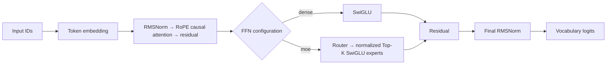
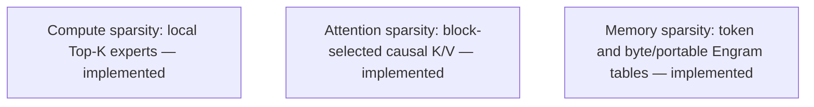

# Decoder architecture

SparseLab is a causal decoder laboratory. Its dense baseline uses RMSNorm, RoPE causal attention, SwiGLU, residual connections, and a tied or untied language-model head. Configurations can independently select local Top-K MoE, token/byte/portable Engram memory, block-sparse attention, or latent attention; each reference path is deliberately small rather than kernel-optimized.

RMSNorm rescales a vector by its reciprocal RMS without centering it. RoPE rotates adjacent query/key pairs by position; relative phase represents distance. The upper-triangular attention mask prevents future-token access. Dense SwiGLU computes `down(silu(gate(x)) * up(x))`. Tied embeddings reuse input-embedding storage for output logits.

## Local Top-K MoE

For each normalized token representation `x`, the router computes `softmax(W_router x)`, selects `experts_per_token` experts, renormalizes the selected weights, and sums their SwiGLU outputs. An optional shared expert runs for every token. The trainer records router entropy, maximum expert fraction, mean selected probability, and auxiliary load-balancing loss.

This is **compute sparsity**, not sparse attention or external memory. The implementation is local: there is no capacity constraint, dropped-token fallback, expert parallelism, or distributed communication. It is a correctness/inspection reference, not a production MoE throughput claim.

## Sliding-window attention

`attention.kind: sliding_window` restricts query position $t$ to keys from
`max(0, t - window_size + 1)` through $t$. It preserves causal masking and
does not change the projections, RoPE, values, output width, or residual
path. The reference implementation applies this boundary as a mask over
ordinary score tensors; it demonstrates attention sparsity but does not claim
a sparse-kernel speedup or long-context scaling result.

## Block-sparse attention

`attention.kind: block_sparse` groups causal keys into fixed-size blocks, scores compressed block keys, and gathers original K/V vectors from the selected blocks. The reference keeps the causal mask after gathering. It records the number of available and selected keys, selection ratio, and a relative selected-key attention-work estimate.

The current implementation uses a Python loop and is intended to make selection behavior inspectable. Its reference test matches dense attention when every causal block is selected; this does not imply equivalence at a restricted retrieval budget or a kernel-level speedup.

## Multi-head latent attention

`attention.kind: mla` first compresses each hidden state to `latent_dim`, then
expands latent keys for RoPE dot products while retaining head-partitioned
latent values. Attention output is projected from latent width back to hidden
width. `latent_dim` must divide evenly across heads. This is a causal reference
implementation; it does not provide a fused latent KV cache or a decode-memory
bandwidth claim.

## Combined reference configuration

`configs/smoke_combined_cpu.yaml` composes MLA attention, local Top-K MoE, and byte-address memory. This verifies that each mechanism receives the required inputs in the ordinary decoder/training path. It is a compatibility smoke, not a joint quality, scaling, or throughput result; compare ablations under matched data, tokenizer, budget, and device conditions.

## Token n-gram memory

The optional adapter hashes each position's inclusive token-ID suffix into a learnable value table. Its value width is independent of the backbone width; an output projection and sigmoid gate add the value to the final hidden state. At position `t`, the address contains only input IDs through `t`, while the model predicts `t + 1`, so it does not read a future target. It is a local trainable parameter table, not external retrieval or a mutable cache.

The hashes are tokenizer-specific token-ID addresses. They are not byte hashes and do not establish byte-equivalent matching, cross-tokenizer knowledge transfer, or retrieval quality.

Byte-addressed and portable variants are documented in [Engram](engram.md) and [portable Engram](portable-engram.md). A portable package preserves frozen source table values and trains only a target-side projection/gate adapter; it is an experiment mechanism, not evidence of knowledge transfer.

Each target is the following packed token. Documents end in EOS; a fixed block can cross an EOS boundary, so EOS separates records but is not an attention barrier. There is no padding branch.

