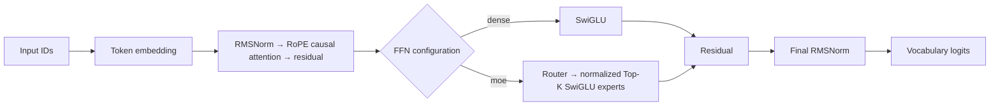
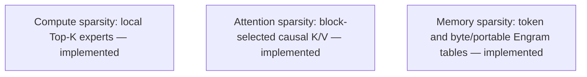

# Decoder architecture

SparseLab is a causal decoder laboratory. Its dense baseline uses RMSNorm, RoPE causal attention, SwiGLU, residual connections, and a tied or untied language-model head. PyTorch configurations can independently select local Top-K MoE, token/byte/portable Engram memory, sliding-window/block-sparse attention, or latent attention. These are correctness/inspection reference paths. The separate MLX engine supports FP32 dense feed-forward models with dense or native block-sparse attention, not the full PyTorch architecture set.

RMSNorm rescales a vector by its reciprocal RMS without centering it. RoPE rotates adjacent query/key pairs by position; relative phase represents distance. The upper-triangular attention mask prevents future-token access. Dense SwiGLU computes `down(silu(gate(x)) * up(x))`. Tied embeddings reuse input-embedding storage for output logits.

## Grouped-query attention

PyTorch dense and sliding-window attention optionally set
`model.num_kv_heads` to a positive divisor of `num_heads`. Queries and the
output projection remain full hidden width, while key and value projections and
the request-local KV cache use `num_kv_heads × head_dim`. Query-head groups
share each KV head through a broadcast group axis; SparseLab does not
materialize repeated K/V tensors. Scores remain query-head-wide, so this is a
storage/projection-width change rather than a claim of a sparse score kernel or
a measured speedup. Omitting the field preserves ordinary multi-head attention
and legacy serialized identities. MLA, block-sparse attention, and MLX reject
unequal KV/query head counts.

## Local Top-K MoE

For each normalized token representation `x`, the router computes `softmax(W_router x)`, selects `experts_per_token` experts, renormalizes the selected weights, and sums their SwiGLU outputs. An optional shared expert runs for every token. The trainer records router entropy, maximum expert fraction, mean selected probability, and auxiliary load-balancing loss.

This is **compute sparsity**, not sparse attention or external memory. The implementation is local: there is no capacity constraint, dropped-token fallback, expert parallelism, or distributed communication. It is a correctness/inspection reference, not a production MoE throughput claim.

## Sliding-window attention

`attention.kind: sliding_window` restricts query position $t$ to keys from
`max(0, t - window_size + 1)` through $t$. It preserves causal masking and
does not change the projections, RoPE, values, output width, or residual
path. The reference implementation applies this boundary as a mask over
ordinary score tensors; it demonstrates attention sparsity but does not claim
a sparse-kernel speedup or long-context scaling result.

## Block-sparse attention

`attention.kind: block_sparse` groups causal keys into fixed-size blocks and scores compressed block keys. The PyTorch reference gathers original K/V vectors from the selected blocks and retains the causal mask. Selection diagnostics distinguish available and selected keys, selection ratio, and an estimated attention-work count.

The PyTorch path uses an inspectable reference loop on CPU and non-ROCm devices. ROCm additionally uses native HIP online-softmax forward/dQ/dK-dV kernels over the selected-key union, with direct K/V access and no token-square softmax intermediates. MLX implements equivalent native Metal kernels. These paths preserve selection semantics; matching dense attention when every causal block is selected does not establish equivalence at a restricted budget or a general end-to-end speedup. See [kernel measurements and limits](sparse-attention.md).

## Multi-head latent attention

`attention.kind: mla` first compresses each hidden state to `latent_dim`, then
expands latent keys for RoPE dot products while retaining head-partitioned
latent values. Attention output is projected from latent width back to hidden
width. `latent_dim` must divide evenly across heads. This is a causal reference
implementation; it does not provide a fused latent KV cache or a decode-memory
bandwidth claim.

## Inference cache versus training state

Supported PyTorch dense and sliding-window generation paths use a bounded,
request-local KV cache with a full-prefix reference available through
`generate(..., use_cache=False)`. With grouped-query attention, each cache
stores only KV heads, while score tensors still use all query heads.
Unsupported cache configurations and native MLX decoding use full-prefix
evaluation. A decode cache is not an Engram table, a durable checkpoint, or a
reduction in training-memory estimates; bounded parity checks are not a
long-context serving benchmark.

## Combined reference configuration

`configs/smoke_combined_cpu.yaml` composes MLA attention, local Top-K MoE, and byte-address memory. This verifies that each mechanism receives the required inputs in the ordinary decoder/training path. It is a compatibility smoke, not a joint quality, scaling, or throughput result; compare ablations under matched data, tokenizer, budget, and device conditions.

## Token n-gram memory

The optional adapter hashes each position's inclusive token-ID suffix into a learnable value table. Its value width is independent of the backbone width; an output projection and sigmoid gate add the value to the final hidden state. At position `t`, the address contains only input IDs through `t`, while the model predicts `t + 1`, so it does not read a future target. It is a local trainable parameter table, not external retrieval or a mutable cache.

The hashes are tokenizer-specific token-ID addresses. They are not byte hashes and do not establish byte-equivalent matching, cross-tokenizer knowledge transfer, or retrieval quality.

Byte-addressed and portable variants are documented in [Engram](engram.md) and [portable Engram](portable-engram.md). A portable package preserves frozen source table values and trains only a target-side projection/gate adapter; it is an experiment mechanism, not evidence of knowledge transfer.

Each prediction target is the following packed token. Conversation supervision may mask context-only targets while retaining those tokens as causal inputs. Documents end in EOS; a fixed block can cross an EOS boundary, so EOS separates records but is not an attention barrier. There is no padding branch.

## Standalone lessons and controlled studies

The [lesson path](research/lesson-paths.md) scaffolds and probes any one supported mechanism without a campaign; a probe is fresh initialized CPU FP32 mechanism evidence, not training evidence. [Research recipes](research/README.md) declare matched controls before users explicitly prepare data and train. The placement recipe supports final and embedding token-memory injection only; it does not represent middle or multiple sites.

## Extension boundary

Each experiment remains one process, one host, and one selected device. An independent [worker controller](workers.md) may schedule several such experiments, without exchanging gradients or sharing optimizer state. New attention or Engram variants must remain explicit configuration choices with documented causal inputs, parameter accounting, checkpoint compatibility, and diagnostics; they must not silently reinterpret an existing mode or imply distributed execution. [ADR 0015](decisions/0015-single-host-extension-boundaries.md) retains the historical local-core decision with its later scheduling amendment noted.
