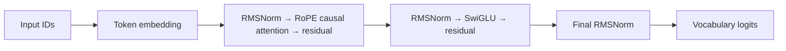
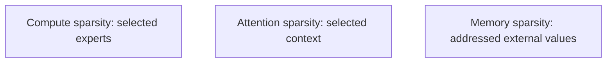

# Dense baseline architecture

SparseLab 0.1 predicts the next token with a causal dense decoder. Input IDs become embeddings, then each pre-norm block applies causal attention and SwiGLU through residual paths.

RMSNorm rescales a vector by the reciprocal RMS without subtracting its mean. RoPE rotates adjacent query/key pairs by position; their relative phase exposes distance. The upper-triangular mask makes every position attend only to itself and earlier tokens. SwiGLU computes `down(silu(gate(x)) * up(x))`. Tied embeddings reuse the input embedding matrix as the output projection.

Each target is the following packed token. Documents end in EOS; a fixed block can cross an EOS boundary, so EOS separates records but is not an attention barrier. There is no padding branch.

The future roadmap distinguishes three unrelated sparsity dimensions:

None of those mechanisms is implemented in this dense milestone.
