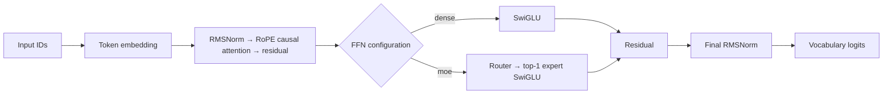
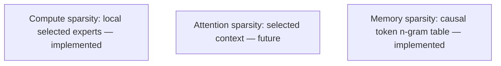

# Decoder architecture

SparseLab uses a causal decoder that predicts the next packed token. Milestone 0.1 uses a dense SwiGLU feed-forward path. Milestone 0.2 can replace only that path with local top-1 MoE. Milestone 0.3 optionally adds a causal token n-gram memory adapter after final RMSNorm; embeddings, attention, and output-head behavior remain unchanged.

RMSNorm rescales a vector by its reciprocal RMS without centering it. RoPE rotates adjacent query/key pairs by position; relative phase represents distance. The upper-triangular attention mask prevents future-token access. Dense SwiGLU computes `down(silu(gate(x)) * up(x))`. Tied embeddings reuse input-embedding storage for output logits.

## Local top-1 MoE

For each normalized token representation `x`, the router computes `softmax(W_router x)`, selects its greatest-probability expert, runs that token through one SwiGLU expert, then scatters the output back to the original token position. The selected top-1 mixing weight is one; router probabilities remain available only for detached diagnostics: counts, fractions, entropy, and maximum fraction.

This is **compute sparsity**, not sparse attention or external memory. The implementation is local: there is no capacity constraint, dropped-token fallback, auxiliary load-balancing objective, expert parallelism, or distributed communication. Every token runs exactly one expert. It therefore does not establish a production MoE throughput claim.

## Sliding-window attention

`attention.kind: sliding_window` restricts query position $t$ to keys from
`max(0, t - window_size + 1)` through $t$. It preserves causal masking and
does not change the projections, RoPE, values, output width, or residual
path. The reference implementation applies this boundary as a mask over
ordinary score tensors; it demonstrates attention sparsity but does not claim
a sparse-kernel speedup or long-context scaling result.

## Multi-head latent attention

`attention.kind: mla` first compresses each hidden state to `latent_dim`, then
expands latent keys for RoPE dot products while retaining head-partitioned
latent values. Attention output is projected from latent width back to hidden
width. `latent_dim` must divide evenly across heads. This is a causal reference
implementation; it does not provide a fused latent KV cache or a decode-memory
bandwidth claim.

## Combined reference configuration

`configs/smoke_combined_cpu.yaml` composes MLA attention, local top-1 MoE, and
byte-address memory. This verifies that each mechanism receives the required
inputs in the ordinary decoder/training path. It is a compatibility smoke, not
a joint quality, scaling, or throughput result; compare ablations under matched
data, tokenizer, budget, and device conditions.

## Token n-gram memory

The optional adapter hashes each position's inclusive token-ID suffix into a learnable value table. Its value width is independent of the backbone width; an output projection and sigmoid gate add the value to the final hidden state. At position `t`, the address contains only input IDs through `t`, while the model predicts `t + 1`, so it does not read a future target. It is a local trainable parameter table, not external retrieval or a mutable cache.

The hashes are tokenizer-specific token-ID addresses. They are not byte hashes and do not establish byte-equivalent matching, cross-tokenizer knowledge transfer, or retrieval quality.

Each target is the following packed token. Documents end in EOS; a fixed block can cross an EOS boundary, so EOS separates records but is not an attention barrier. There is no padding branch.

