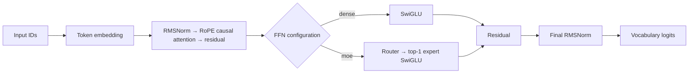
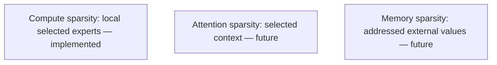

# Decoder architecture

SparseLab uses a causal decoder that predicts the next packed token. Milestone 0.1 uses a dense SwiGLU feed-forward path. Milestone 0.2 can replace only that path with local top-1 MoE; embeddings, RMSNorm, RoPE attention, residuals, and the output head are unchanged.

RMSNorm rescales a vector by its reciprocal RMS without centering it. RoPE rotates adjacent query/key pairs by position; relative phase represents distance. The upper-triangular attention mask prevents future-token access. Dense SwiGLU computes `down(silu(gate(x)) * up(x))`. Tied embeddings reuse input-embedding storage for output logits.

## Local top-1 MoE

For each normalized token representation `x`, the router computes `softmax(W_router x)`, selects its greatest-probability expert, runs that token through one SwiGLU expert, then scatters the output back to the original token position. The selected top-1 mixing weight is one; router probabilities remain available only for detached diagnostics: counts, fractions, entropy, and maximum fraction.

This is **compute sparsity**, not sparse attention or external memory. The implementation is local: there is no capacity constraint, dropped-token fallback, auxiliary load-balancing objective, expert parallelism, or distributed communication. Every token runs exactly one expert. It therefore does not establish a production MoE throughput claim.

Each target is the following packed token. Documents end in EOS; a fixed block can cross an EOS boundary, so EOS separates records but is not an attention barrier. There is no padding branch.

