# Dashboard tour

`sparselab dashboard` opens a local, read-only Streamlit app. The **Lab** pages
come first. Each one answers a single researcher question, opens with the
verdict, explains its numbers in plain words and, when it has nothing to show,
names the command that would fill it. Run telemetry (training curves, runtime,
memory, checkpoints) and the Learn/Research pages follow in their own sections.

```sh
uv run --locked --extra cpu sparselab dashboard               # WORK_DIR/runs + WORK_DIR/lab
uv run --locked --extra cpu sparselab dashboard --lab-dir DIR --runs-dir DIR
```

| Page | Question | What you see |
|---|---|---|
| **Home** | What happened, and what should I do next? | latest verdict, next-step cards with commands, counts, recent tries and probes |
| **Experiments** | Did my change help, and is the evidence good enough to act on? | verdict banner, per-probe table and charts, per-probe trends, history, side-by-side compare |
| **Models** | Where does each checkpoint sit on cost vs quality, next to known models? | checkpoint catalog, Pareto frontier, reference models, runs nobody has scored yet |
| **Behaviors** | What does the model actually do, and where does it fail? | greedy generations side by side, fact-recall hits and misses, needle by length, reliability diagram |
| **Explorer** | What is inside this model, and how does it process a sentence? | architecture diagram, per-token loss and top-k, attention maps, weight stats, expert routing, memory lookups |

Every page reads lab records through the same verified reader as
`sparselab report` (`sparselab.lab_records`). A record that fails its seal is
listed as rejected, never shown as a result. Numbers are only put next to each
other inside one comparison group (`eval_group` for held-out loss,
`benchmark_group` for lm-eval, `item_group` for fact recall). A value from
another group is labelled **not comparable** and never silently mixed in.

Colors follow one palette (`sparselab.dashboard.ui`). Status colors pass WCAG
AA contrast against white text, and they always come with an icon (✔ ▲ ✖ ≠ ⊘),
so color is never the only signal. Charts use colorblind-safe series colors and
a perceptually uniform heatmap scale (Viridis). The layout is wide and its
columns stack on narrow screens.

The screenshots below come from a demo lab: a 2-layer, 32-dimension baseline
trained for 60 steps on synthetic text, plus four one-variable tries (wider
FFN, a third layer, 4 experts with 1 active, an n-gram memory table) at the
standard tier, one full-tier probe and three explorations. The models are tiny
on purpose. The point is how the pages read, not the scores.

## Home


The newest probe verdict leads (the same banner as `sparselab probe`). Next to
it, **Next steps** turns the lab's state into commands, each with a reason:

- the latest verdict, when it names a command (escalate, compare, rerun);
- candidate checkpoints that have held-out loss but no fact-recall or needle
  evidence yet (`sparselab probe RUN --tier standard`);
- no lab checkpoint has lm-eval accuracy yet, so none sits on the reference
  curve (`--tier full`);
- plain `sparselab train` runs that no lab record has scored
  (`sparselab probe RUN --runs-dir DIR`);
- runs nobody has looked inside yet (`sparselab explore RUN`).

At most four steps are shown, in this order.

Recent activity lists tries and probe batteries, newest first, verdict first.
A try that never reached a verdict says so (for example `failed`). An empty lab
shows the two commands that get you started.

## Experiments

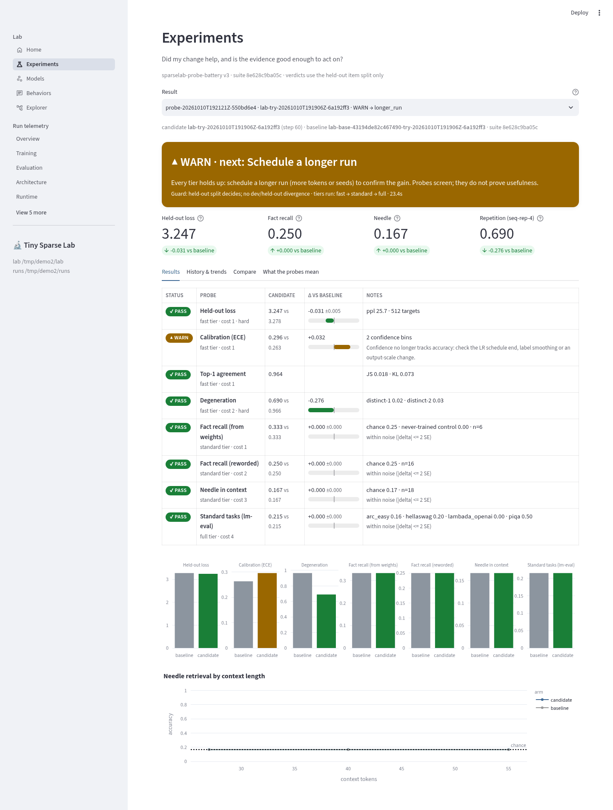

Pick a result (a try's arms or a `sparselab probe` record). The page shows:

- the banner (verdict, next action, held-out guard, tiers run);
- four headline metrics;
- the probe table, with a meter centred on the baseline whose full half-bar is
  the fail threshold;
- baseline vs candidate bars;
- needle accuracy by length.

**History & trends** plots any probe across every result, colored by verdict.
A trend only joins results measured the same way: one probe-suite digest and
one comparison group (the eval group for held-out probes, the benchmark group
for lm-eval, the item group for recall and needle). Pick the group in the
selector (default: the newest result's); the other groups are hidden and
counted, and older results that recorded no group are listed as such. It also
lists tries that never ran a probe battery, each with the command to probe it.

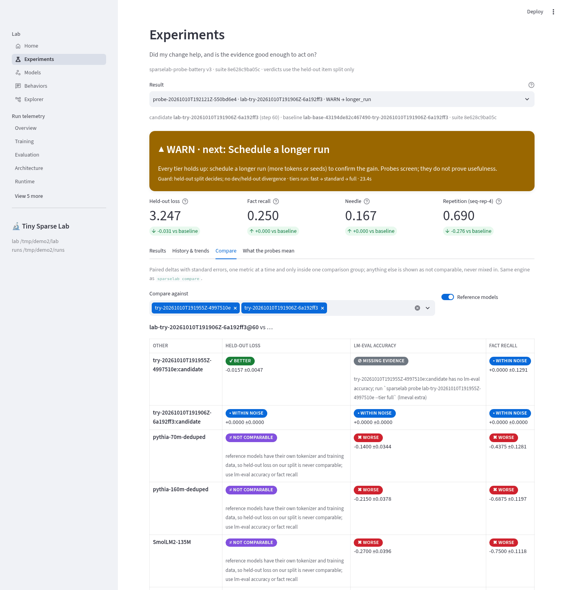

**Compare** runs the same engine as `sparselab compare`: paired deltas ± SE for
each metric against other results and, optionally, the reference models. Cells
read **better**, **worse** or **within noise** (|Δ| ≤ 2 SE). **Not comparable**
gives the reason (for example, held-out loss against a reference with another
tokenizer). **Missing evidence** names the command that measures it.

## Models

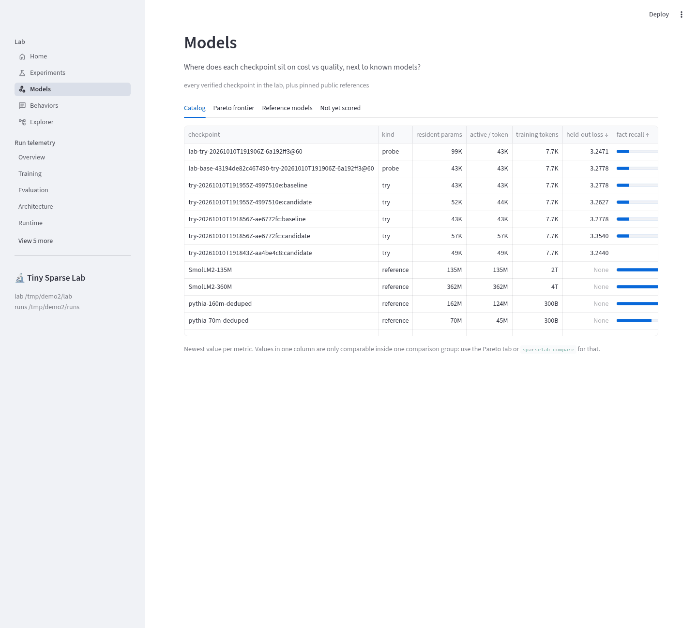

The **Catalog** has one row per verified checkpoint: resident and active
parameters, training tokens, and the newest held-out loss, fact recall and
lm-eval accuracy, with the records they came from. The caption reminds you
that a column is only comparable inside one group.

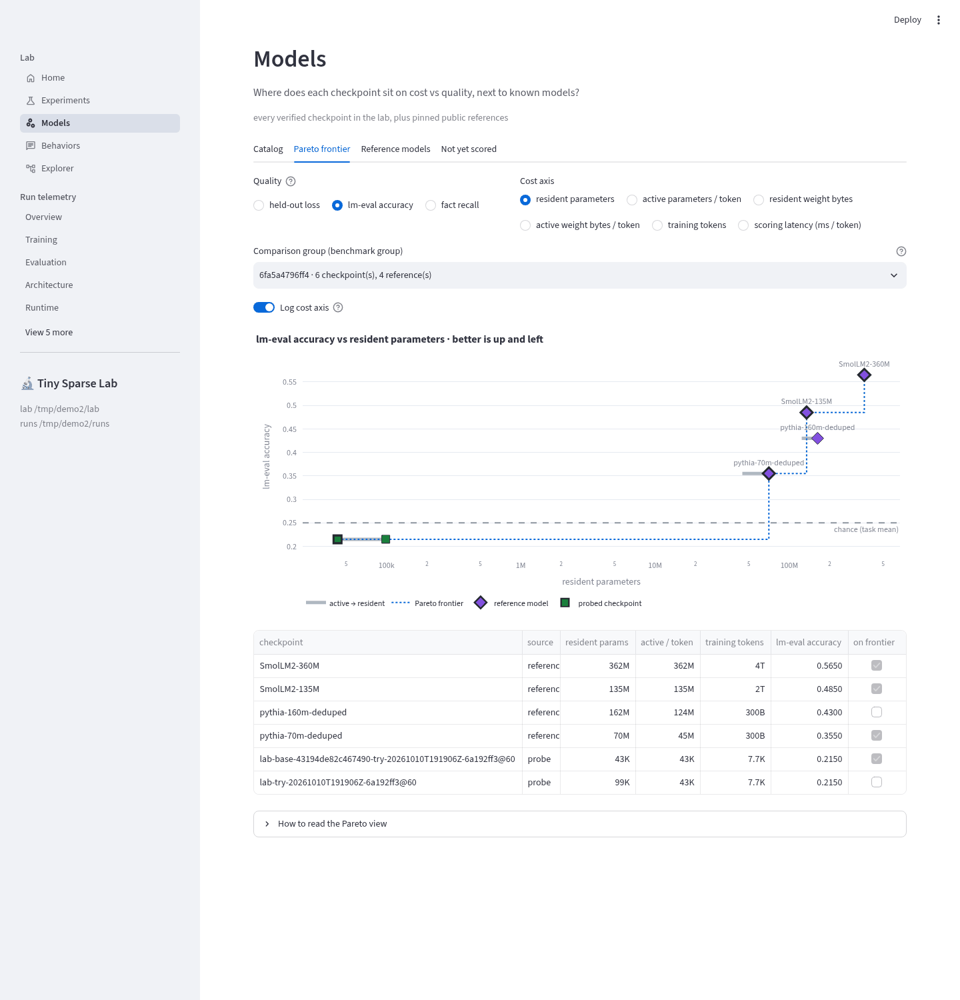

**Pareto frontier** plots quality (held-out loss, lm-eval accuracy or fact
recall) against a cost (resident or active parameters, weight bytes, training
tokens, scoring latency) within one comparison group. Reference models appear
as purple diamonds wherever they share the group (lm-eval and fact recall,
never our held-out loss). Details: [probe battery](probe-battery.md#dashboard).

**Reference models** lists the pinned public checkpoints and their packaged
scores, and explains what they can and cannot tell you. **Not yet scored**
lists plain `sparselab train` runs in the run directories that no try or probe
has measured, each with the `sparselab probe RUN --runs-dir DIR` command that
places it in the catalog and on the frontier.

## Behaviors

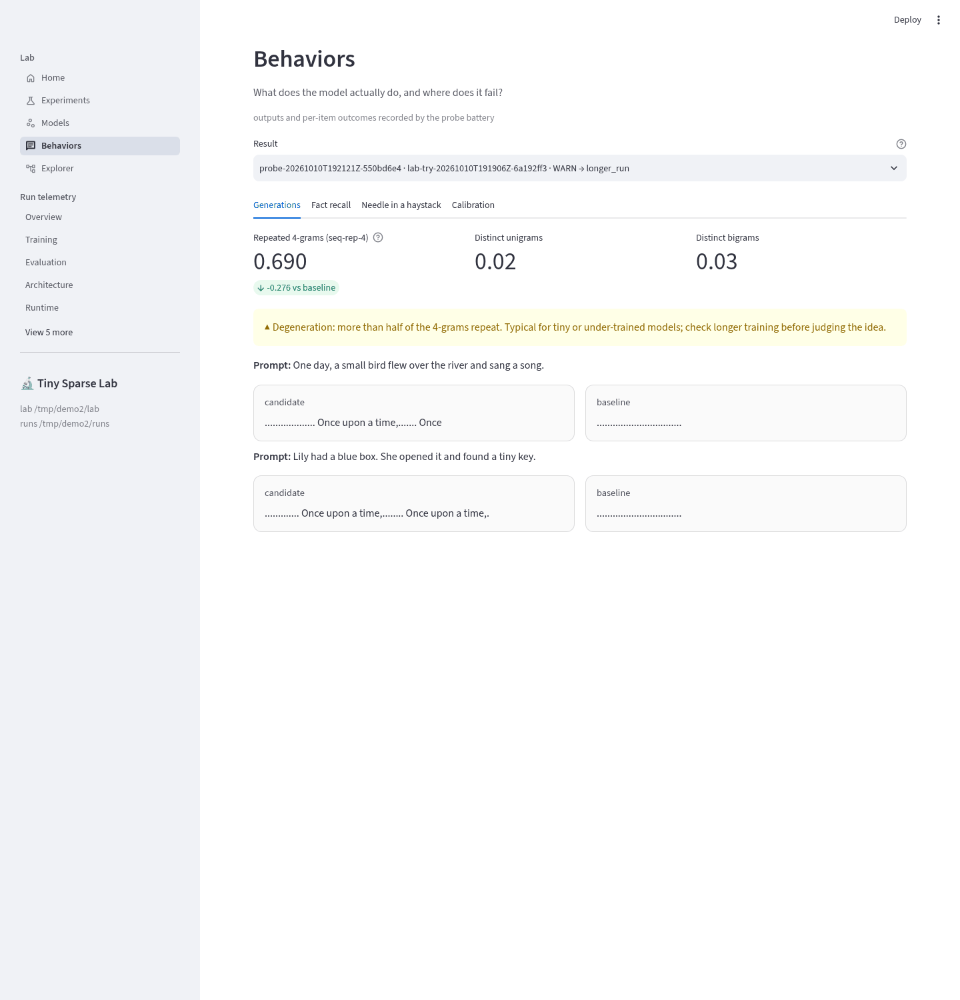

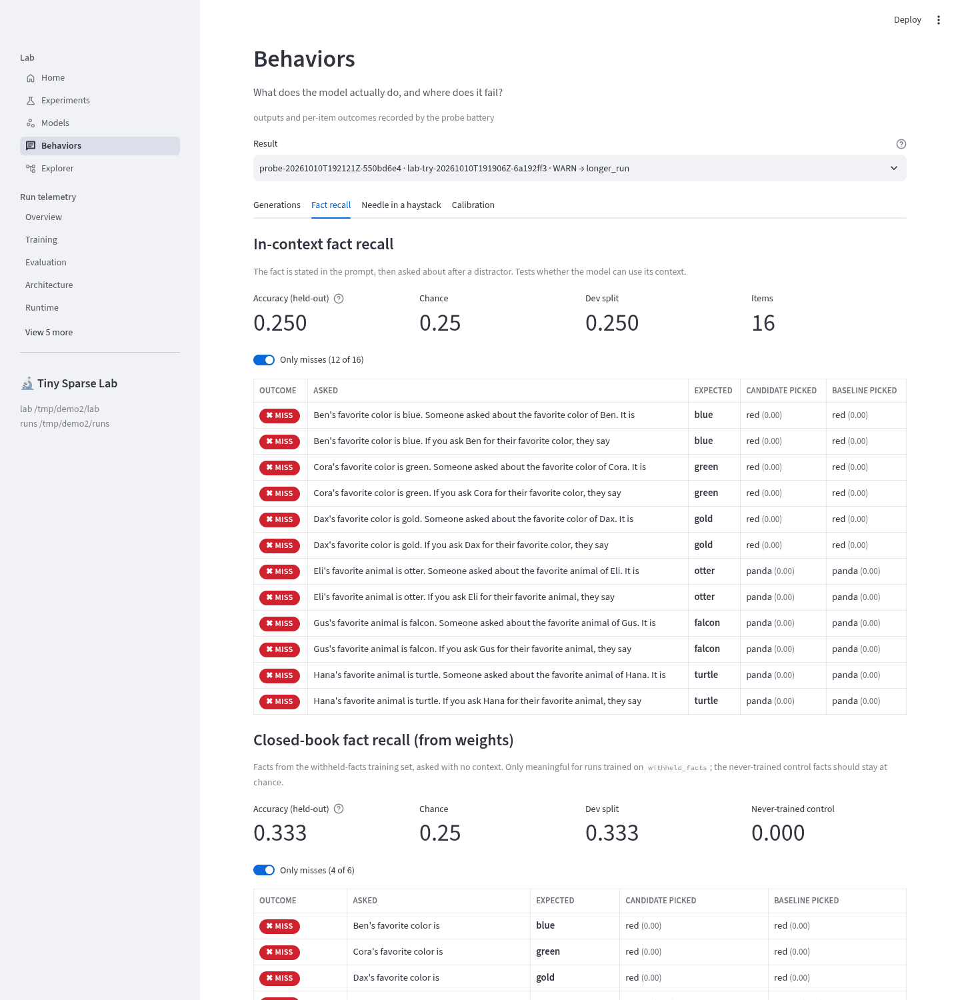

- **Generations.** The degeneration probe's greedy continuations, candidate
  next to baseline, with seq-rep-4 and distinct-n. A loop warning appears when
  more than half of the 4-grams repeat.
- **Fact recall.** Every held-out item with what was expected and what each
  arm picked (fractional credit for ties), misses first. In-context recall (the
  fact is stated in the prompt) and closed-book recall (the run's own
  withheld-facts training facts, from its `dataset.synthetic_seed`, asked with
  no context) sit side by side; for a run not trained on `withheld_facts` the
  closed-book block shows why it was not scored instead. The
  closed-book block also shows the never-trained control facts, which should
  stay at chance. The demo above shows what this is for: every lab model picks
  the same first candidate for every question (`red`, `panda`), which no
  aggregate accuracy would tell you.
- **Needle in a haystack.** Retrieval accuracy against context length, one line
  per checkpoint (its newest result) within one item group. Needle lengths are
  in each model's own tokens, so results with other items, tokenizers or
  lengths are another group: pick it in the selector (default: the newest
  result's group; the others are counted as hidden). The chance line comes from
  that group's own results and is omitted when it is unknown or they disagree.
- **Calibration.** A reliability diagram (confidence of the top guess against
  how often it was right; marker size = share of tokens), candidate against
  baseline, with ECE.

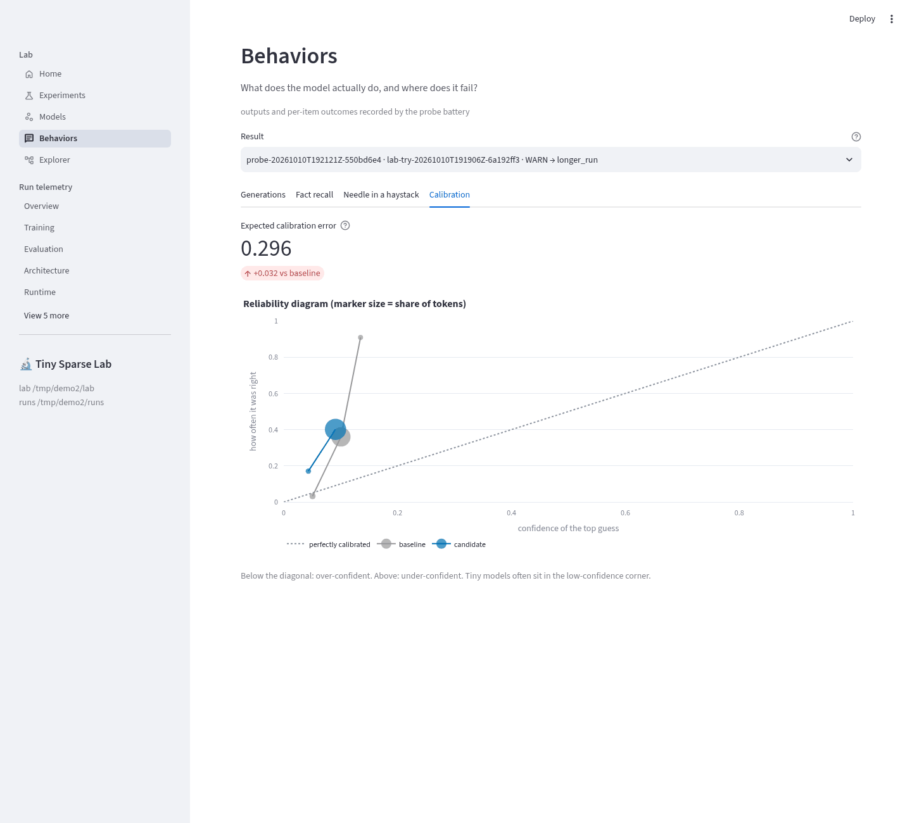

## Explorer

The explorer looks inside a small checkpoint: up to
`sparselab.explorer.MAX_PARAMETERS` (60M) parameters and `MAX_TOKENS` (128)
tokens of sample text. Bigger models get a clear message and only the
architecture diagram, which comes from the config alone, so nothing is loaded.
Explore from the page (pick a run and a sentence) or from the CLI:

```sh
uv run --locked --extra cpu sparselab explore RUN --text "Once upon a time"
uv run --locked --extra cpu sparselab explore RUN --json        # the full payload
```

Results are cached as sealed records under
`LAB/explorer/<checkpoint sha>/<key>.json`, keyed by checkpoint digest, sample
text and explorer format. An edited cache file is ignored and recomputed.
Exploration goes through the same runtime preparation as `sparselab probe` and
`sparselab try`: the run is resolved, `--backend` (default `cpu`) or
`--runtime`/`--runtime-profile` is applied and authorized by the run's runtime
policy (an accelerator needs a runtime profile, exactly as for probe), and the
checkpoint loads through the verified loader. `--resource-envelope FILE` is
checked before the command and again before every explorer stage; a violation
stops it with the reason. The dashboard page always explores on CPU. Loading the
checkpoint is a stage like the others: the cancel sentinel and envelope are
checked before it, an out-of-memory error while loading or exploring becomes a
clear message, memory is released either way and nothing is cached. It stops
at the next stage if `LAB/explorer/CANCEL` appears. MLX checkpoints
and attached semantic packs are refused with a reason.

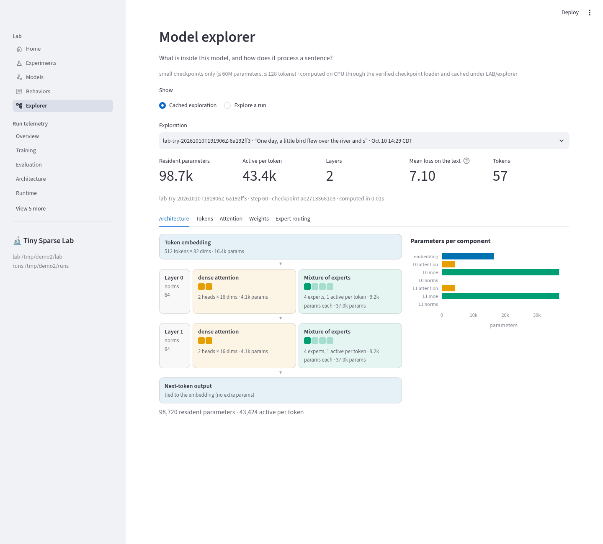

- **Architecture.** Embedding → each layer (attention heads, dense FFN or
  experts with the active ones highlighted) → memory table → output, with
  parameter counts per component taken from the shape-only tensor inventory.
- **Tokens.** The sample text with each token shaded by its loss. Hover a token
  for its loss, rank and the model's next guesses. Below it: a per-token loss
  chart and the top-k guesses after any position, from the shared scoring path
  the probes use.

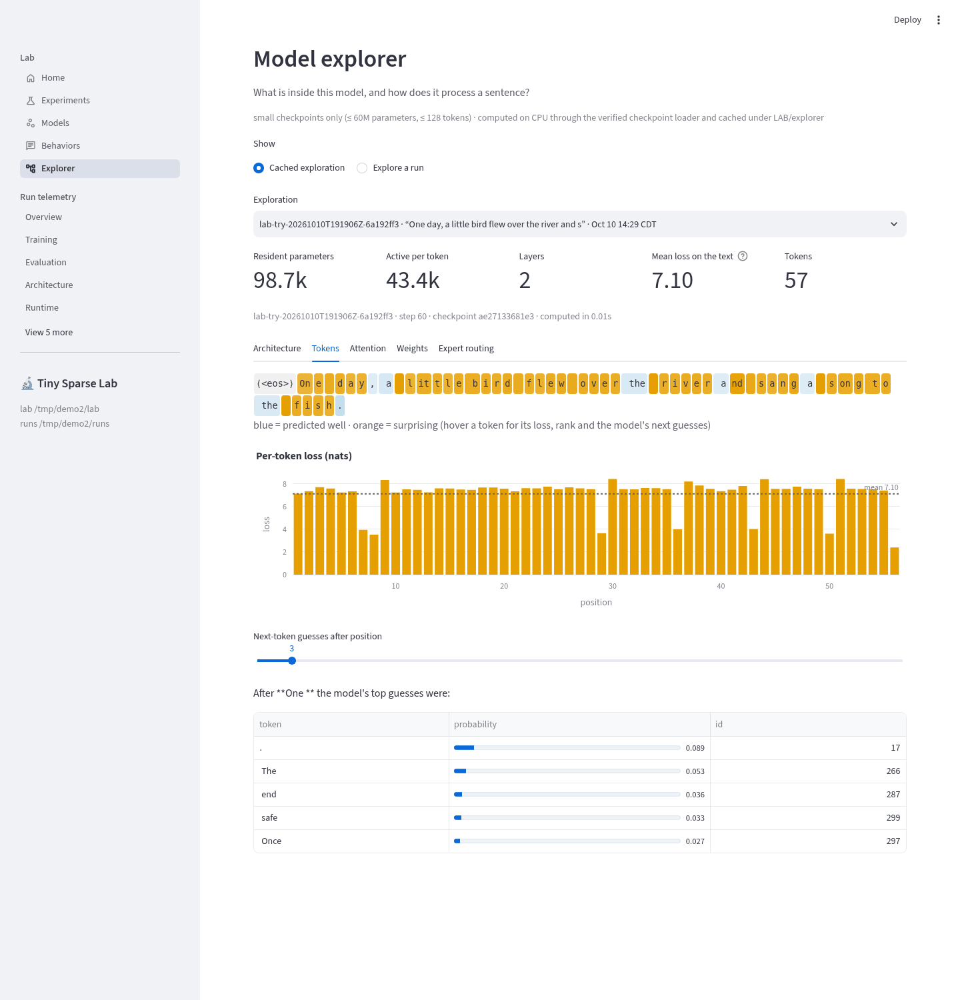

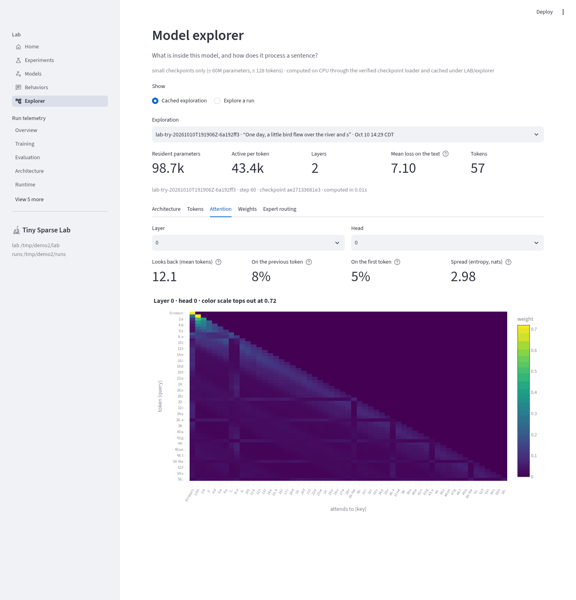

- **Attention.** One heatmap per layer and head, computed by the attention
  module's own softmax (`DenseAttention.attention_probabilities`, which the
  forward pass also uses). Four plain numbers describe the head: how far back
  it looks, its share on the previous token, its share on the first token
  (attention sink) and its spread (entropy). Latent and block-sparse layers
  select or compress keys and expose no per-key weights; the page says so
  rather than showing something made up.
- **Weights.** RMS per stored tensor (hover for norm, max |w| and shape) and a
  histogram of any tensor (sampled above 200k values, which the title says).

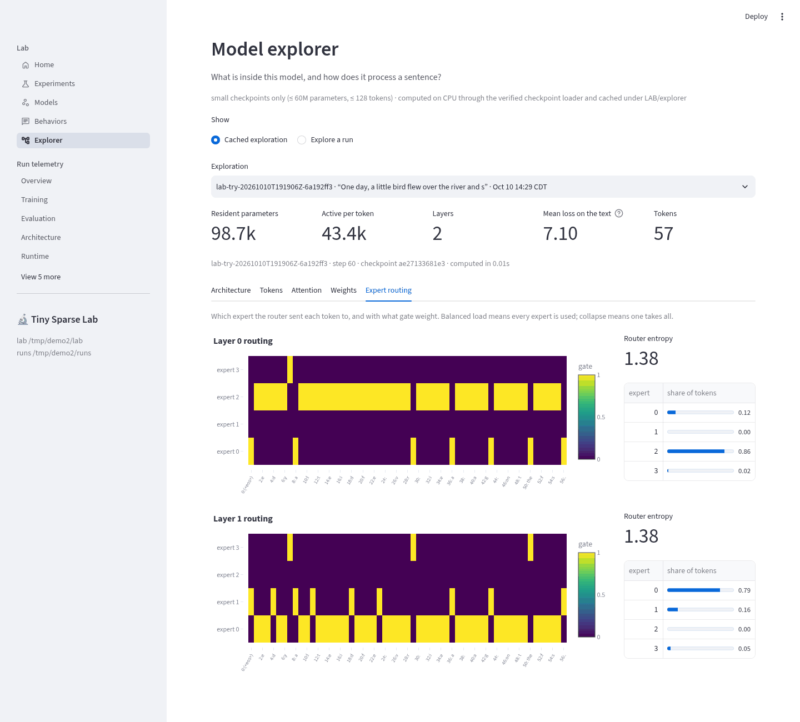

- **Expert routing** (MoE runs). A token × expert heatmap of gate weights per
  layer, router entropy and each expert's share of tokens, so you can see
  collapse at a glance.

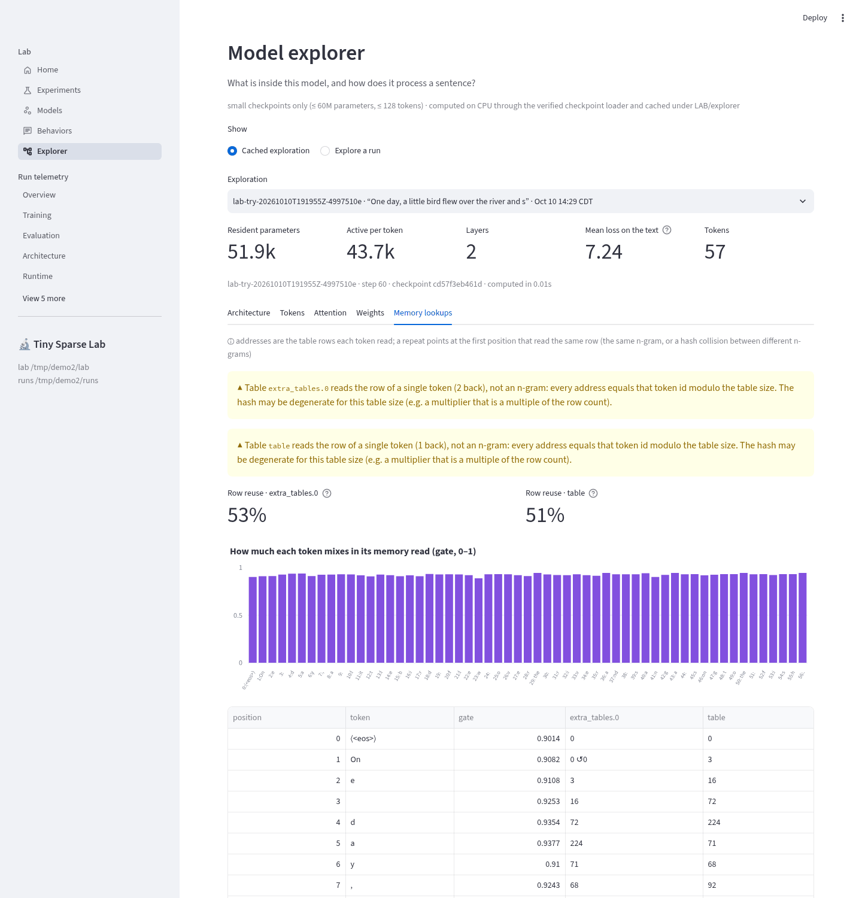

- **Memory lookups** (memory runs). The rows each token read in each table
  (↺ marks a row an earlier position already read: the same n-gram or a hash
  collision), each table's reuse rate and the per-token memory gate. When every
  address of an n-gram table is just one earlier token's id modulo the table
  size, a warning says the table is acting as a single-token table. In the demo
  this caught a real problem: with `memory_table_size: 257` the legacy n-gram
  hash multiplier (257) was a multiple of the row count, so the order-2 and
  order-3 tables read the previous token and the one before it, not n-grams.
  The hash now switches to a mixed scheme at such sizes (`sparselab.address_hash`,
  see TODO.md); the screenshot predates the fix.

## For developers

- `sparselab.dashboard.lab_data`: everything the lab pages show, with no
  Streamlit import (tested in `tests/test_dashboard_lab.py`).
- `sparselab.dashboard.lab_pages`: the five pages. `probes.py` keeps the
  shared probe components (banner, table, charts, Pareto). `explorer_view.py`
  turns an exploration into figures and HTML. `ui.py` holds the palette, chips,
  page headers and empty states.
- `sparselab.explorer`: the explorer data layer. It reads architecture from
  the config, and weights and activations from the verified loader. Attention
  comes from the module's own softmax, memory reads from forward hooks on the
  tables (the hash is never re-implemented), and routing from
  `diagnostics="full"`.
- Page renders are tested with `streamlit.testing.v1.AppTest` (empty and
  populated labs, the real `app.py` entry point). CI's `lab-loop` job runs
  them together with the probe and explorer tests.
