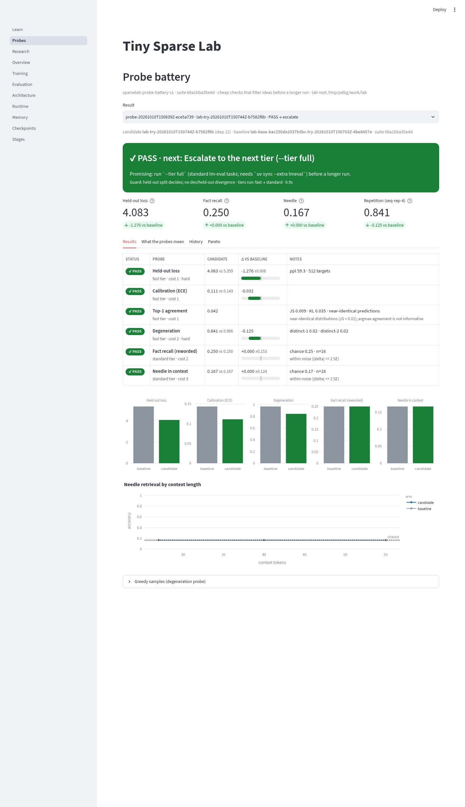

# Probe battery: fast-fail checks for any checkpoint

The probe battery is a small, versioned suite of cheap checks that tells you, in
seconds to minutes, whether an idea is worth a longer run. It runs on any
checkpoint, against a baseline checkpoint, and ends with a machine-readable
verdict and a recommended next action.

```sh
# Every lab try runs the fast tier automatically (disable with --probe-tier none).
uv run --locked --extra cpu sparselab try wider-ffn.yaml --vs BASELINE.yaml

# Any run or checkpoint, any tier.
uv run --locked --extra cpu sparselab probe RUN_OR_CHECKPOINT --vs BASELINE_RUN --tier standard
uv run --locked --extra cpu sparselab probe RUN --vs BASE --json      # stable schema
uv run --locked --extra cpu sparselab report probe-20261010T150839Z-ece5a739

# Standard lm-eval tasks (optional extra).
uv sync --locked --extra cpu --extra lmeval
uv run --locked --extra cpu --extra lmeval sparselab probe RUN --vs BASE --tier full
```

A target is a run directory, a checkpoint directory inside a run, or a run id
under `WORK_DIR/lab/runs` (or `--runs-dir`). Results land in
`WORK_DIR/lab/probes/<probe-id>/probe.json` (sealed with `result_sha256`;
`report` rejects edited records). A try stores its result in `try.json` under
`probe`.

```text
PROBE BATTERY  sparselab-probe-battery v1 · suite 68a1bba3 · tier standard (ran fast → standard) · 0.9s
  candidate lab-try-20261010T150744Z-b7582f8b  step 12 · 1.5k tokens · 43.2k params
  baseline  lab-base-bac250de2037b5bc-try-20261010T150703Z-4be8457e  step 12 · 1.5k tokens · 43.2k params

  ✔ PASS     Held-out loss           4.083 vs 5.359    ◀◀◀◀◀│·····  Δ -1.276 (-23.8%) ±0.006   ppl 59.3
  ✔ PASS     Calibration (ECE)       0.111 vs 0.143    ··◀◀◀│·····  Δ -0.032
  ✔ PASS     Top-1 agreement         0.042                                                     JS 0.009 · KL 0.035 (near-identical: agreement uninformative)
  ✔ PASS     Degeneration            0.841 vs 0.966    ··◀◀◀│·····  Δ -0.125                   distinct-2 0.02
  ✔ PASS     Fact recall (reworded)  0.250 vs 0.250    ·····│·····  Δ +0.000 ±0.153            chance 0.25
  ✔ PASS     Needle in context       0.167 vs 0.167    ·····│·····  Δ +0.000 ±0.124            by length ▂▂▂ (27/40/55 tok)

  verdict ✔ PASS  next → ESCALATE (--tier full)
  Promising: run `--tier full` (standard lm-eval tasks; needs `uv sync --extra lmeval`) before a longer run.
  guard   verdicts use the held-out split · ok · fact_recall dev +0.00 / held-out +0.00; needle dev +0.17 / held-out +0.00
  legend  meter ◀ better │ worse ▶ (full = fail threshold)
```

The meter is centred on the baseline; a full half-bar is the probe's fail
threshold. Colors follow `NO_COLOR`/`FORCE_COLOR` and are off when piped.

## Probes

Probes run cheapest first: by tier, then declared cost.

| Probe | Tier · cost | Metric | Judged on (warn / fail) | Hard | A failure suggests |
|---|---|---|---|---|---|
| Held-out loss | fast · 1 | mean token cross-entropy on the validation split, same eval protocol as the baseline | relative increase 0.5% / 3% | yes | the change hurts at this budget; revert or retune LR/warmup |
| Calibration (ECE) | fast · 1 | top-1 expected calibration error, 15 equal-width bins (Guo et al. 2017) | +0.02 / +0.05 | no | confidence no longer tracks accuracy (schedule end, output scale) |
| Top-1 agreement | fast · 1 | argmax agreement with the baseline on fixed held-out prompts, plus KL(base‖cand) and JS in nats | below 0.5 (warn only) | no | a large behavior shift; informative only together with loss |
| Degeneration | fast · 2 | seq-rep-4 of greedy continuations (Welleck et al. 2019), distinct-1/2 (Li et al. 2016) | +0.05 / +0.20 | yes | loops: duplicated data, too-high LR, positional change |
| Fact recall (reworded) | standard · 2 | ranks the stated answer among candidates from the same relation, asked in different words than the fact was stated | −0.05 / −0.15 | no | context handling or memory wiring |
| Needle in context | standard · 3 | retrieve a code word stated at the start of a filler context at ~50/75/95% of `max_seq_len` | −0.05 / −0.15 | no | attention span, positions or sequence-length changes |
| Standard tasks (lm-eval) | full · 4 | mean `acc` over lambada_openai, hellaswag, arc_easy, piqa at `limit=50` | −0.02 / −0.05 | no | treat small moves as noise at tiny scale |

**Noise.** Loss uses the paired per-window standard error; accuracies use the
binomial SE of a difference. A change within 2 SE counts as `pass` with a
"within noise" note, never as a win or a regression.

**Tiny-model honesty.** Fact recall is *in-context* (the fact is stated, then
asked in other words), because a tiny model knows no facts; parametric recall
lives in the withheld-facts study. When both models are near-uniform (JS < 0.01)
top-1 agreement is meaningless and is reported as uninformative instead of
warning. lm-eval tasks are borrowed for their established metric definitions,
but tiny models sit at or near chance (≈0.25 hellaswag/arc_easy, 0.5 piqa, ≈0
lambada); at `limit=50` a difference of a few points is noise. The full tier
records each task, the chance level and this caveat in the result.

## Tiers and fast-fail

- `fast` (default for `try`): loss, calibration, agreement, degeneration; well
  under a second on the CPU smoke model.
- `standard`: adds reworded fact recall and needle retrieval.
- `full`: adds lm-eval. Without the `lmeval` extra the probe is `skipped` with
  the install hint; nothing else changes.

A **hard** probe that fails (held-out loss, degeneration) stops the battery at
once; the remaining probes are `skipped`. Any other failure finishes the current
tier but the battery does not escalate ("not promising"). `--no-fast-fail` runs
everything. A probe that crashes is recorded as `error`; it never sinks the
battery or the try.

## Verdict and next action

`verdict` is `{status, action, next_tier, reasons, suggestion}`; actions are:

| Condition (first match) | status | action |
|---|---|---|
| no baseline | info | `compare` |
| a hard probe failed | fail | `abandon` |
| any probe failed | fail | `tweak` (that probe's hint) |
| overfit guard fired | warn | `tweak` |
| held-out loss improved beyond noise, tiers left | pass/warn | `escalate` with `next_tier` |
| held-out loss improved beyond noise, all tiers run | pass/warn | `longer_run` |
| otherwise (no measurable gain) | pass/warn | `tweak` |

## Held-out guard

Every item set has a **dev** split and a **held-out** split (different facts,
templates, needles, filler and prompts). Verdicts only use the held-out split.
Agents may look at dev results while iterating; the guard flags
`overfit_suspected` when the dev gain is beyond its binomial noise and exceeds
the held-out gain by more than `max(0.15, 2 SE)`. Never edit probe items to make
an idea pass: changing any item or threshold changes the suite digest, and a
digest change requires bumping `SUITE_VERSION` (a pinned test enforces this).
Compare results only within one suite digest; the dashboard warns when history
mixes suites.

## Result schema (`sparselab-probe-v1`)

Top level: `format`, `created_at`, `suite` (`name`, `version`, `sha256`, split
digests, `verdict_split`), `tier`, `tiers_run`, `fast_fail` (`stopped`, `at`,
`reason`), `target`/`baseline` (run id, checkpoint and its sha256, step, tokens
seen, parameters, parameter bytes, tokenizer and validation digests,
`max_seq_len`), `comparable`, `protocol`, `probes`, `guard`, `verdict`,
`seconds`; standalone records add `probe_id` and `result_sha256`.

Each probe row: `id`, `title`, `tier`, `cost`, `metric`, `higher_is_better`,
`hard`, `thresholds` (`mode`, `warn`, `fail`), `suggests`, `explains`,
`reference`, `status` (`pass|warn|fail|info|skipped|not_comparable|error`),
`value`, `baseline_value`, `delta`, `regression` (positive = worse; relative for
loss), `delta_se`, `within_noise`, `improved`, `note`, `details`, `seconds`.
Keys are stable within a format version; `tests/test_probes.py` pins them.

## Dashboard

`sparselab dashboard` has a **Probes** page (reads `WORK_DIR/lab`, or
`--lab-dir`): live progress of a running battery, the verdict banner, per-probe
results against the baseline with meters, charts and greedy samples, a "What
the probes mean" explainer, history across tries and probes, and a Pareto view
of held-out loss against parameters, weight bytes, training tokens or latency.


