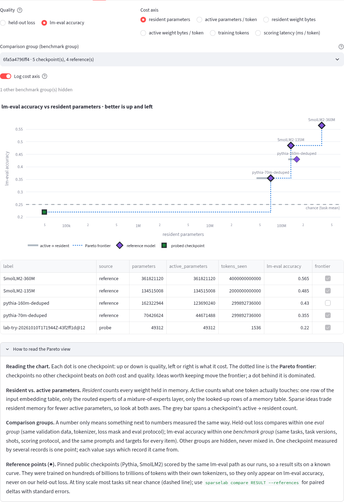
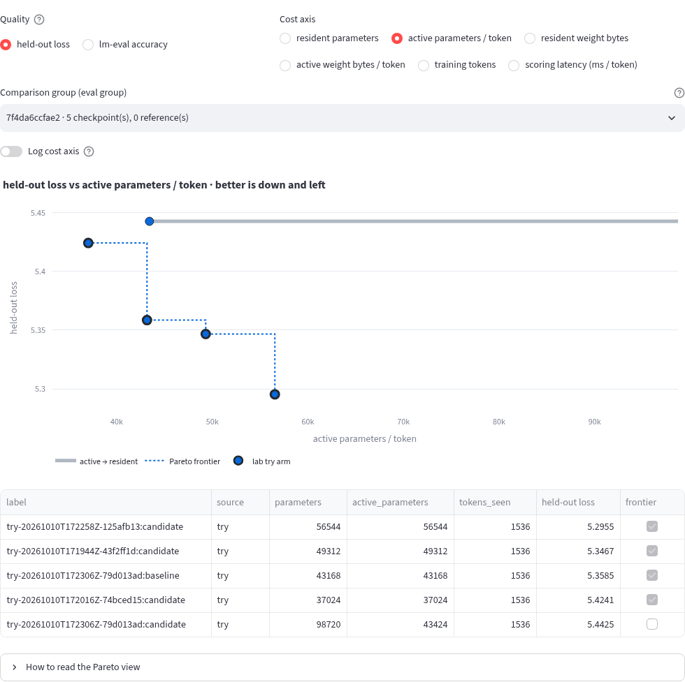

# Probe battery: fast-fail checks for any checkpoint

The probe battery is a small, versioned suite of cheap checks that tells you, in
seconds to minutes, whether an idea is worth a longer run. It runs on any
checkpoint, against a baseline checkpoint, and ends with a machine-readable
verdict and a recommended next action.

**Probes screen; they do not prove usefulness.** A pass means "nothing obvious
broke and loss moved the right way on a small fixed sample", nothing more.
Selecting ideas again and again on the held-out probe items slowly turns them
into development data, so keep a separate, untouched final evaluation (a fresh
data split, a longer run, more seeds) for any claim that an idea is better.

```sh
# Every lab try runs the fast tier automatically (disable with --probe-tier none).
uv run --locked --extra cpu sparselab try wider-ffn.yaml --vs BASELINE.yaml

# Any run or checkpoint, any tier.
uv run --locked --extra cpu sparselab probe RUN_OR_CHECKPOINT --vs BASELINE_RUN --tier standard
uv run --locked --extra cpu sparselab probe RUN --vs BASE --json      # stable schema
uv run --locked --extra cpu sparselab report probe-20261010T150839Z-ece5a739

# Standard lm-eval tasks (optional extra).
uv sync --locked --extra cpu --extra lmeval
uv run --locked --extra cpu --extra lmeval sparselab probe RUN --vs BASE --tier full

# Place a result on the reference curve (reads records; no download, no compute).
uv run --locked --extra cpu sparselab compare TRY_OR_PROBE_ID --references
```

A target is a run directory, a checkpoint directory inside a run, or a run id
under `WORK_DIR/lab/runs` (or `--runs-dir`). Results land in
`WORK_DIR/lab/probes/<probe-id>/probe.json`, sealed with `record_sha256` by
the same lab-record writer as `try.json`. `report`, `probe` and the dashboard
read every record through one verified reader (`sparselab.lab_records`), so an
edited record is rejected everywhere. A try stores its result in `try.json`
under `probe`.

```text
PROBE BATTERY  sparselab-probe-battery v2 · suite ec0544e7 · tier full (ran fast → standard → full) · 24.5s
  candidate lab-try-20261010T154716Z-f24f162a  step 12 · 1.5k tokens · 43.2k params
  baseline  lab-base-7e2b3094a1c9b4b2-try-20261010T154716Z-f24f162a  step 12 · 1.5k tokens · 43.2k params

  ✔ PASS        Held-out loss             4.083 vs 5.359    ◀◀◀◀◀│·····  Δ -1.276 (-23.8%) ±0.006   ppl 59.3
  ✔ PASS        Calibration (ECE)         0.111 vs 0.143    ··◀◀◀│·····  Δ -0.032
  ✔ PASS        Top-1 agreement           0.042                                                     JS 0.009 · KL 0.035 (near-identical: agreement uninformative)
  ✔ PASS        Degeneration              0.841 vs 0.966    ··◀◀◀│·····  Δ -0.125                   distinct-2 0.02
  ✔ PASS        Fact recall (reworded)    0.250 vs 0.250    ·····│·····  Δ +0.000 ±0.183            chance 0.25
  ✔ PASS        Needle in context         0.167 vs 0.167    ·····│·····  Δ +0.000 ±0.000            by length ▂▂▂ (27/40/55 tok)
  ✔ PASS        Standard tasks (lm-eval)  0.225 vs 0.225    ·····│·····  Δ +0.000                   lambada 0.00 hellaswag 0.20 arc 0.14 piqa 0.56

  verdict ✔ PASS  next → LONGER RUN
  Every tier holds up: schedule a longer run (more tokens or seeds) to confirm the gain. Probes screen; they do not prove usefulness.
  guard   verdicts use the held-out split · ok · fact_recall dev +0.00 / held-out +0.00; needle dev +0.17 / held-out +0.00
  legend  meter ◀ better │ worse ▶ (full = fail threshold)
```

The meter is centred on the baseline; a full half-bar is the probe's fail
threshold. Colors follow `NO_COLOR`/`FORCE_COLOR` and are off when piped.

## Probes

Probes run cheapest first: by tier, then declared cost.

| Probe | Tier · cost | Metric | Judged on (warn / fail) | Hard | A failure suggests |
|---|---|---|---|---|---|
| Held-out loss | fast · 1 | mean token cross-entropy on the validation split, same eval protocol as the baseline | relative increase 0.5% / 3% | yes | the change hurts at this budget; revert or retune LR/warmup |
| Calibration (ECE) | fast · 1 | top-1 expected calibration error, 15 equal-width bins (Guo et al. 2017) | +0.02 / +0.05 | no | confidence no longer tracks accuracy (schedule end, output scale) |
| Top-1 agreement | fast · 1 | argmax agreement with the baseline on fixed held-out prompts, plus KL(base‖cand) and JS in nats | below 0.5 (warn only) | no | a large behavior shift; informative only together with loss |
| Degeneration | fast · 2 | seq-rep-4 of greedy continuations (Welleck et al. 2019), distinct-1/2 (Li et al. 2016) | +0.05 / +0.20 | yes | loops: duplicated data, too-high LR, positional change |
| Fact recall (reworded) | standard · 2 | ranks the stated answer among candidates from the same relation (mean token log-prob), asked in different words than the fact was stated; fractional tie credit | −0.05 / −0.15 | no | context handling or memory wiring |
| Needle in context | standard · 3 | retrieve a code word stated at the start of a filler context at ~50/75/95% of `max_seq_len`; fractional tie credit | −0.05 / −0.15 | no | attention span, positions or sequence-length changes |
| Standard tasks (lm-eval) | full · 4 | mean `acc` over lambada_openai, hellaswag, arc_easy, piqa at `limit=50` | −0.02 / −0.05 | no | treat small moves as noise at tiny scale |

**Credit.** Recall and needle rank candidates by mean token log-prob of
`" " + candidate` after the prompt. When k candidates tie at the top score the
item earns 1/k if the answer is among them, else 0, so a model that scores
everything alike lands at chance, never at 100% (ties used to break toward the
answer; a uniform-score regression test pins this).

**Noise.** Each probe declares its `uncertainty`. Held-out loss is a ratio
(sum of token NLL / tokens) over evaluation windows, so its delta SE is the
token-weighted, window-clustered delta-method SE of the difference
(`window_clustered_ratio`). Recall and needle compare the same items on both
arms, so their delta SE is the paired SE of the per-item credit differences
(`paired_items`). A change within 2 SE counts as `pass` with a "within noise"
note, never as a win or a regression.

**Tiny-model honesty.** Fact recall is *in-context* (the fact is stated, then
asked in other words), because a tiny model knows no facts; parametric recall
lives in the withheld-facts study. When both models are near-uniform (JS < 0.01)
top-1 agreement is meaningless and is reported as uninformative instead of
warning. lm-eval tasks are borrowed for their established metric definitions,
but tiny models sit at or near chance (≈0.25 hellaswag/arc_easy, 0.5 piqa, ≈0
lambada); at `limit=50` a difference of a few points is noise. The full tier
records each task, the chance level and this caveat in the result.

## Tiers and fast-fail

- `fast` (default for `try`): loss, calibration, agreement, degeneration; well
  under a second on the CPU smoke model.
- `standard`: adds reworded fact recall and needle retrieval.
- `full`: adds lm-eval. The `lmeval` extra stays optional: without it the probe
  is `unavailable` with the install hint and the battery is **incomplete**
  (see below), never a pass.

The lm-eval adapter scores through the same token-scoring path as the probes
(`sparselab.probes.scoring`). It follows the harness boundary rules (trailing
context whitespace moves to the continuation; context and continuation are
encoded together and split at the context's token count; an empty context is
the end-of-text token) and scores every continuation token, windowing with
maximal left context when a continuation is longer than `max_seq_len`. A task
that produces no accuracy is an error, i.e. missing evidence.

A **hard** probe that fails (held-out loss, degeneration) stops the battery at
once; the remaining probes are `skipped`. A NaN/inf loss raised by the native
evaluator is a **numerical failure**, a distinct outcome rather than a probe
error: the held-out loss row fails with `details.numerical_failure`, the battery
stops (`fast-fail: numerical failure in heldout_loss`) and the verdict is
`fail`/`abandon` with a numerical-failure reason and suggestion, even without a
baseline. If the *baseline* is the one that fails numerically, nothing can be
judged against it and the row is `error` (missing evidence). Any other failure finishes the current
tier but the battery does not escalate ("not promising"). `--no-fast-fail` runs
everything. A probe that crashes is recorded as `error`; it never sinks the try,
but it is missing evidence: the battery does not escalate past it and the
verdict is `incomplete`.

## Missing evidence, cancellation and resources

A check that should have produced evidence and did not is never a success.
`unavailable` (optional dependency missing, unsupported engine), `error` (the
probe raised) and `not_comparable` rows, and probes left unrun by a stop, are
listed in `verdict.missing` with the reason, printed as `missing ...` lines and
shown in the dashboard banner. Unless a real failure already decides the
verdict, the status is `incomplete` and the action is `rerun`.

Arms are loaded one at a time: per tier the baseline is loaded, measured and
released, then the candidate is loaded, measured and judged probe by probe, so a
battery never holds two models in memory. Inside `try` the battery runs under
the try's own context (the same `CANCEL` sentinel, `--resource-envelope` and
SIGINT/SIGTERM handling as training and scoring); standalone `probe` creates
`LAB/probes/<id>/CANCEL` as its sentinel and accepts `--resource-envelope` too.
The context is checked before each arm and before every probe. `stop.kind`
records why a battery stopped: `fast_fail` (hard failure, including a
numerical failure), `not_promising`
(a failure in an earlier tier), `missing_evidence` (an earlier tier is
incomplete), `cancelled` (sentinel), `resources` (envelope violated) or `oom`
(host `MemoryError` or a torch out-of-memory error, which stops further probe
work instead of becoming an error row) or `interrupted` (Ctrl-C or SIGTERM).
Everything measured before the stop is kept: on a signal the battery is
finalized (unrun probes listed as missing evidence, verdict `incomplete`), the
progress file is marked `stopped` and the sealed record is published before the
command exits (130 for standalone `probe`; `try` records `interrupted` at
`phase: probing`). Inside `try`, a stopped battery never undoes the training comparison: a
cancel during probing marks the try `interrupted` and keeps both scored arms and
the comparison; resources or OOM leave the try `completed` with an incomplete
battery.

Validation is scored once per arm. Inside `try` the scoring pass doubles as the
probe's validation pass (an observer on the native evaluator collects per-window
sums and top-1 confidences); standalone, held-out loss and calibration share one
pass that is computed only on a cache miss.

## Verdict and next action

`verdict` is `{status, action, next_tier, reasons, missing, suggestion}`;
actions are:

| Condition (first match) | status | action |
|---|---|---|
| numerical failure (NaN/inf held-out loss) | fail | `abandon` |
| no baseline (a reference model only once every task and item is scored) | info | `compare` |
| a hard probe failed | fail | `abandon` |
| any probe failed | fail | `tweak` (that probe's hint) |
| missing evidence (unavailable, error, not comparable, stopped by cancel/resources/OOM) | incomplete | `rerun` (names each gap) |
| reference model: a benchmark task or item unscored (error, OOM, partial) | incomplete | `rerun` (names the unscored tasks; never placed on the curve) |
| overfit guard fired | warn | `tweak` |
| held-out loss improved beyond noise, tiers left | pass/warn | `escalate` with `next_tier` |
| held-out loss improved beyond noise, all tiers run | pass/warn | `longer_run` |
| otherwise (no measurable gain) | pass/warn | `tweak` |

## Held-out guard

Every item set has a **dev** split and a **held-out** split (different facts,
templates, needles, filler and prompts). Verdicts only use the held-out split.
Agents may look at dev results while iterating; the guard flags
`overfit_suspected` when the dev gain is beyond its paired noise and exceeds
the held-out gain by more than `max(0.15, 2 SE)`. Never edit probe items to make
an idea pass: changing any item or threshold changes the suite digest, and a
digest change requires bumping `SUITE_VERSION` (a pinned test enforces this;
v2 introduced fractional tie credit and the declared uncertainty methods).
Compare results only within one suite digest; the dashboard warns when history
mixes suites.

## Result schema (`sparselab-probe-v1`)

Top level: `format`, `created_at`, `suite` (`name`, `version`, `sha256`, split
digests, `verdict_split`), `tier`, `tiers_run`, `stop` (`stopped`, `kind`, `at`,
`reason`), `target`/`baseline` (run id, checkpoint and its sha256, step, tokens
seen, parameters, parameter bytes, tokenizer and validation digests,
`max_seq_len`, `eval_group`), `comparable`, `protocol`, `probes`, `guard`,
`verdict`, `seconds`; standalone records add `probe_id` and `record_sha256`.
`eval_group` hashes the validation data, tokenizer, loss mask and eval
protocol: losses are only comparable within one group.

Each probe row: `id`, `title`, `tier`, `cost`, `metric`, `higher_is_better`,
`hard`, `thresholds` (`mode`, `warn`, `fail`), `uncertainty`, `suggests`,
`explains`, `reference`, `status`
(`pass|warn|fail|info|skipped|unavailable|not_comparable|error`),
`value`, `baseline_value`, `delta`, `regression` (positive = worse; relative for
loss), `delta_se`, `within_noise`, `improved`, `note`, `details`, `seconds`.
Keys are stable within a format version; `tests/test_probes.py` pins them.

## Reference models and `sparselab compare`

Our runs should sit on a known curve, not only next to each other. Four public
checkpoints in the 70M–360M range are pinned in
`sparselab.reference_models` (immutable Hugging Face commits, safe snapshots
only: static metadata and `*.safetensors`, no pickles, remote code or
quantization configs; the same rules as the Pythia trajectory adapter):

| Reference | Repository @ commit | Resident / active params | Training tokens (model card) |
|---|---|---|---|
| `ref:pythia-70m-deduped` | `EleutherAI/pythia-70m-deduped@9a7c847e` (step 143000) | 70.4M / 44.7M | 299,892,736,000 |
| `ref:pythia-160m-deduped` | `EleutherAI/pythia-160m-deduped@c54a0e0b` (step 143000) | 162.3M / 123.7M | 299,892,736,000 |
| `ref:SmolLM2-135M` | `HuggingFaceTB/SmolLM2-135M@93efa2f0` | 134.5M / 134.5M | "2T" |
| `ref:SmolLM2-360M` | `HuggingFaceTB/SmolLM2-360M@f8027fd0` | 361.8M / 361.8M | "4T" |

A reference is scored by the same battery, the same token-scoring path and the
same lm-eval adapter as our checkpoints:

```sh
uv sync --locked --extra cpu --extra reference --extra lmeval
uv run --locked --no-sync sparselab probe ref:SmolLM2-135M --tier full
uv run --locked --no-sync sparselab compare --list-references
```

Only the lm-eval probe applies to a reference (`--tier full` is required); its
held-out loss on our validation split is never computed or compared, because
it has its own tokenizer and training data. A reference is never a `--vs`
baseline. Without the optional extras the command stops before any work with
`uv sync --extra reference --extra lmeval`.

**Packaged results.** The sealed probe records of all four references ship in
`src/sparselab/probes/reference_results/` and are verified on read like any lab
record, so `compare`, the dashboard and CI use them without downloading a
model. Measured on CPU (fp32, lm-eval 0.4.13, transformers 4.57.6) with the
`full` tier's tasks at `limit=50`, zero-shot; two independent runs gave
identical records. They were re-sealed when the benchmark group gained item
prompt/target identities and the scoring-protocol version; the scored items,
per-item outcomes, accuracies and checkpoint digests did not change:

| Reference | lambada_openai | hellaswag | arc_easy | piqa | mean `acc` |
|---|---|---|---|---|---|
| pythia-70m-deduped | 0.28 | 0.30 | 0.30 | 0.54 | 0.355 |
| pythia-160m-deduped | 0.36 | 0.42 | 0.34 | 0.60 | 0.430 |
| SmolLM2-135M | 0.36 | 0.44 | 0.52 | 0.62 | 0.485 |
| SmolLM2-360M | 0.42 | 0.46 | 0.64 | 0.74 | 0.565 |

These are 50-item slices, not the published full-task numbers; compare them
only with results in the same benchmark group (below). To refresh them, run
`sparselab probe ref:NAME --tier full` for each reference and copy the sealed
`probe.json` to `reference_results/NAME.json`; `tests/test_references.py`
checks every packaged record against the pinned registry.

**Comparison groups.** A number is only compared with numbers measured the same
way:

- held-out loss within one `eval_group` (validation data, tokenizer, loss mask,
  eval protocol), as before;
- lm-eval accuracy within one `benchmark_group`: a digest of the harness, the
  scoring-protocol version (`sparselab-lmeval-scoring-v1`), tasks, task
  versions, shots, `limit`, the metric used per task and, per item, a hash of
  its document, its rendered requests (context and continuation) and its
  target(s) (`details.benchmark`), so a reworded prompt or a changed target is a
  different group. Each task's per-item outcomes are
  kept (`details.tasks.<task>.items`) so two results in the same group get a
  **paired** standard error: per-task paired SEs combined as `sqrt(Σ se_t²)/T`.
  The battery's own lm-eval row uses the same paired SE, and refuses a
  baseline in another benchmark group (`not_comparable`).

`sparselab compare RESULT [RESULT…] [--references] [--json]` reads sealed
records only (a try/probe id, a record path or `ref:NAME`; the first is the
subject). Each point is completed with compatible evidence for the **same
checkpoint** (same checkpoint sha256) from every verified record in the lab:
per (comparison group, checkpoint) each field keeps its newest available value
and its source. So when `compare TRY --references` reports missing lm-eval
evidence and suggests `sparselab probe TRY --tier full`, rerunning the same
`compare TRY` picks up that probe and says where the number came from. It and prints one table of points and, per metric, each pair as
better/worse/within noise (|Δ| ≤ 2 paired SE), **NOT COMPARABLE** with the
reason, or **MISSING EVIDENCE** with the command that produces it:

```text
COMPARE  try-20261010T171944Z-43f2ff1d:candidate vs 4 point(s) · comparisons only within one eval/benchmark group

    point                                      resident    active   tokens  held-out loss  lm-eval acc
  ▶ try-20261010T171944Z-43f2ff1d:candidate       49.3k     49.3k     1.5k          5.347        0.220
  ◆ pythia-70m-deduped                            70.4M     44.7M   299.9B              –        0.355
  ◆ pythia-160m-deduped                          162.3M    123.7M   299.9B              –        0.430
  ◆ SmolLM2-135M                                 134.5M    134.5M     2.0T              –        0.485
  ◆ SmolLM2-360M                                 361.8M    361.8M     4.0T              –        0.565

  held-out loss (lower is better)
    ≠ NOT COMPARABLE vs pythia-70m-deduped, pythia-160m-deduped, SmolLM2-135M, SmolLM2-360M
      ↳ reference models have their own tokenizer and training data, so held-out loss on our split is never comparable; use lm-eval accuracy

  lm-eval accuracy (higher is better)
    ✖ WORSE         vs pythia-70m-deduped                        Δ -0.135 ±0.033  (subject measured in probe-20261010T182330Z-e7ef2268)
    ✖ WORSE         vs pythia-160m-deduped                       Δ -0.210 ±0.037  (subject measured in probe-20261010T182330Z-e7ef2268)
    ✖ WORSE         vs SmolLM2-135M                              Δ -0.265 ±0.038  (subject measured in probe-20261010T182330Z-e7ef2268)
    ✖ WORSE         vs SmolLM2-360M                              Δ -0.345 ±0.039  (subject measured in probe-20261010T182330Z-e7ef2268)

  reference curve (lm-eval accuracy)
    ▶ try-20261010T171944Z-43f2ff1d:candidate   49.3k params                   0.220 █████████
    ◆ pythia-70m-deduped                        70.4M params (44.7M active)    0.355 ██████████████
    ◆ pythia-160m-deduped                       162.3M params (123.7M active)  0.430 █████████████████
    ◆ SmolLM2-135M                              134.5M params                  0.485 ███████████████████
    ◆ SmolLM2-360M                              361.8M params                  0.565 ███████████████████████
    chance (task mean) 0.250
```

(A 49k-parameter smoke model trained on 1.5k tokens, so it sits below chance on
this slice; the point is the placement, not the score.) `--json` emits
`{subject, points, comparisons, curve}`.

## Dashboard

`sparselab dashboard` has a **Probes** page (reads `WORK_DIR/lab`, or
`--lab-dir`): live progress of a running battery, the verdict banner (with any
missing evidence), per-probe results against the baseline with meters, charts
and greedy samples, a "What the probes mean" explainer, history across tries and
probes, and a Pareto view. The page reads records through the same verified
reader as `report` and lists rejected (edited or unreadable) records instead of
showing them.

The **Pareto view** plots quality (held-out loss, or lm-eval accuracy) against
a cost: resident parameters, active parameters per token, resident or active
weight bytes, training tokens or scoring latency (ms/token). *Resident* counts
every weight in memory; *active* counts what one token touches (one embedding
row, the routed experts, the looked-up memory rows), and a grey bar spans each
checkpoint's active → resident range. Points come from every verified lab
record through `sparselab.probes.points` (shared with `compare`): each scored
arm of every `try`, including tries run with `--probe-tier none`, every probe
target and baseline, and the packaged reference results (purple diamonds,
lm-eval only). One point per (comparison group, checkpoint): compatible
measurements are merged field by field, each keeping its newest available value
with its source (`evidence`), so a newer record without latency does not drop an
older record's latency. It plots only within one comparison group (`eval_group` for loss,
`benchmark_group` for lm-eval), chosen with a selector that defaults to the
selected result's group; hidden groups, points without the chosen cost and
older records without a group are counted in a caption, never mixed in. The
dotted frontier respects the metric's direction, the dashed line is the chance
level, a log cost axis is on by default when references are present, and "How
to read the Pareto view" explains it for learners.






